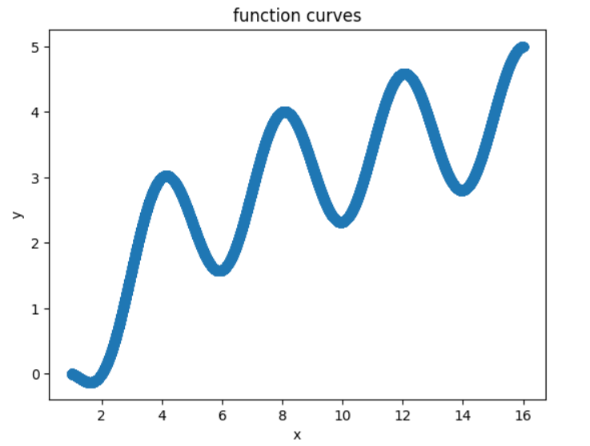
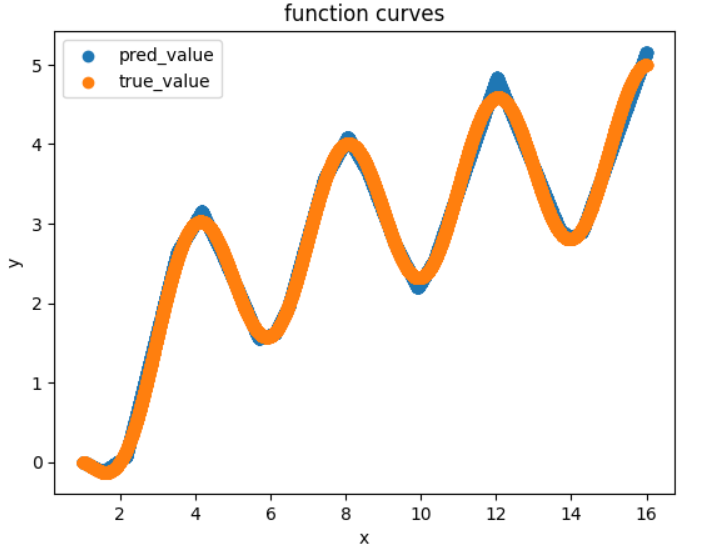
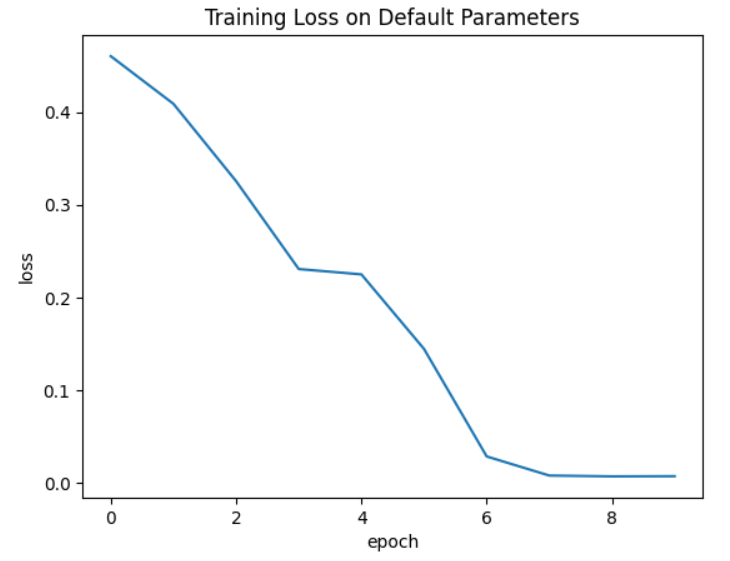
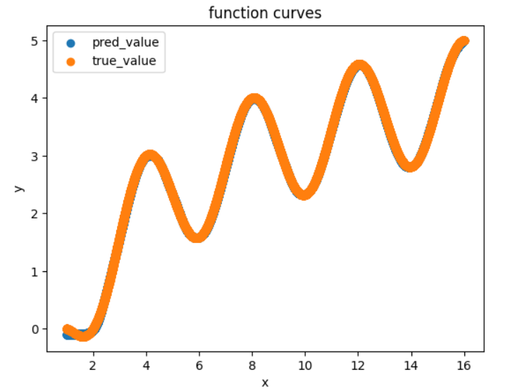
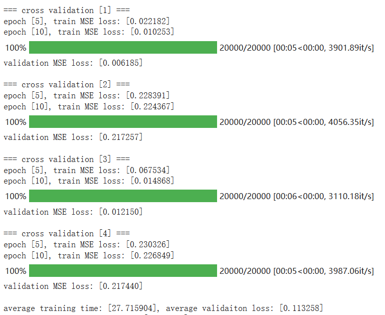
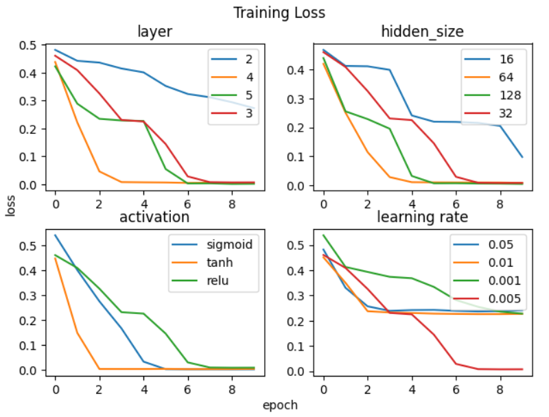
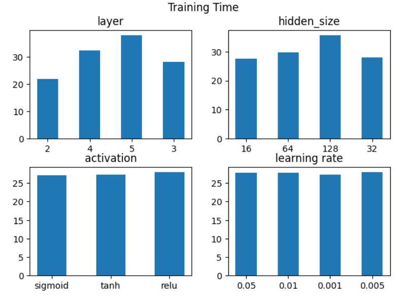
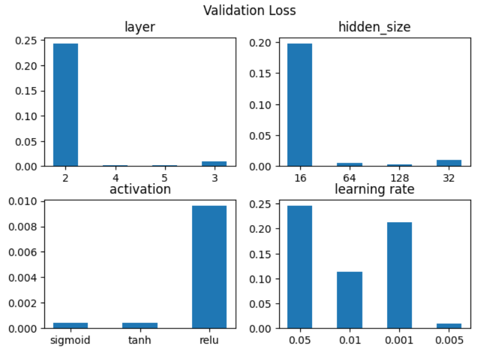

# Lab1 实验报告

PB20111689 蓝俊玮			实验环境：Google Colab

[TOC]

## 实验步骤

### 1. 数据生成

本次实验所近似拟合的函数为：
$$
y=\log_2(x)+\cos(\frac{\pi x}{2}),\quad x\in[1,16]
$$
在本次实验中，实验的数据集仅需要使用程序自动生成，即在 $[1, 16]$ 的范围内随机采样作为函数的 `x` 值，并且计算出函数相应的 `y` 值。因为实验中要求生成三个互不相交的数据集分别作为训练集、验证集和测试集。因此我们采用 `train_test_split` 函数用来划分数据集。

在本次实验中，我们实际上默认以 `6:2:2` 的比例来划分得到训练集、验证集和测试集。在下面的函数中，我们首先将测试集划分出来，然后将剩余的数据作为训练集和验证集，在后续的实验操作中使用 `4` 折交叉验证法来评估模型的性能指标，并且以此结果来对网络深度、学习率、网络宽度、激活函数等模型的超参数进行调整。

本次实验中的所有的随机数种子都为 `1689`，即我的学号。

```python
def generate_dataset(num, test_size=0.2, random_state=1689):
    """ 生成数据集，并且划分出训练集和验证集，测试集，默认以8:2的比例划分
    :param num: 总数据集的大小
    :param test_size: 测试集的大小
    :random_state: 随机种子
    """
    X = torch.empty((num, 1), dtype=torch.float32).uniform_(1, 16)
    y = torch.log2(X) + torch.cos(torch.pi / 2 * X)
    X_, test_X, y_, test_y = train_test_split(X, y, test_size=test_size, random_state=random_state)
    return (X_, y_), (test_X, test_y)
```

在本次的实验中，生成数据规模为 `100000` 的数据集。

```python
# generate dataset
(X_, y_), (test_X, test_y) = generate_dataset(num=100000)
```

生成数据集之后，我们可以查看函数的原始图像如下：



### 2. 模型搭建

本次实验，我将选择 pytorch 作为我的网络框架。首先我在下面设置了默认的参数为：`layer=3, hidden_size=32, activation="relu"`，因为这些参数是我的最初尝试，且性能表现不错，因此后续调参分析会以此默认参数来进行比较分析。

为了让网络的结构和规模能够根据参数而变化，即我们的模型需要动态调整，因此我选择实现时使用 `add_module` 函数。由于输入层的输入大小和输出层的输出大小都是 `1`，因此在添加网络结构的时候，我们需要对输入层和输出层进行特别判断。

最后的网络模型的结构就是以 `nn.Sequential()` 作为整体结构，然后根据参数动态添加网络模块。

```python
class DNN(nn.Module):
    def __init__(self, layer=3, hidden_size=32, activation="relu"):
        super(DNN, self).__init__()
        input_size = 1
        output_size = 1
        self.dnn = nn.Sequential()

        self.activation = nn.ReLU()
        if activation == "sigmoid":
            self.activation = nn.Sigmoid()
        if activation == "tanh":
            self.activation = nn.Tanh()

        for i in range(1, layer + 1):
            if i == 1:
                self.dnn.add_module("hidden_layer1", nn.Linear(input_size, hidden_size))
                self.dnn.add_module(activation + str(i), self.activation)
                continue
            
            if i == layer:
                self.dnn.add_module("output_layer", nn.Linear(hidden_size, output_size))
                continue
            
            self.dnn.add_module("hidden_layer" + str(i), nn.Linear(hidden_size, hidden_size))
            self.dnn.add_module(activation + str(i), self.activation)
```

### 3. 模型训练

模型训练时主要采用交叉验证法进行模型的训练和评估，`4` 折的原因是为了让训练集和验证集的大小比为 `6:2`，也是为了减少训练时间。在该函数中，还会记录返回平均的训练时间，平均的验证集 `MSELoss` 和最后一次训练时的损失曲线，这些返回值可以用来比较分析不同模型参数的性能。**但是在下面的代码讲解中，这些用于型嫩分析的相关代码操作已经被省略，具体可以查看源代码。**

```python
def crossvalid4_eval(estimator, X, y, lr=0.005, random_state=1689, verbose=True):
    """ 4折交叉训练并验证
    :param estimator: 需要使用的网络模型
    :param X: 目标数据集
    :param y: 数据集标签
    :param lr: 优化器的学习率
    :param random_state: 随机种子
    :param verbose:
    """

    kf = KFold(n_splits=4, shuffle=True, random_state=random_state)

    for i, (train_index, valid_index) in enumerate(kf.split(X)):
        device = "cuda" if torch.cuda.is_available() else "cpu"
        model = copy.deepcopy(estimator).to(device)
        model.device = device

        # Training Process
        
        # Validation Process
    
    return avg_train_time, avg_valid_loss, train_losses
```

首先是通过 `KFold` 函数对数据集进行划分，得到训练集和验证集的索引，根据这些索引我们便可以划分得到训练集和验证集。接着是模型训练的过程，为了方便讲解，这里将训练过程展示出来：

```python
# Training Process
criterion = nn.MSELoss()
optimizer = torch.optim.Adam(model.parameters(), lr=lr)

n_epochs = 10
batch_size = 32

train_dataset = Data.TensorDataset(train_X, train_y)
train_loader = Data.DataLoader(train_dataset, batch_size, shuffle=True)
for epoch in range(1, n_epochs + 1):
    model.train()
    for batch in train_loader:
        x, value = batch
        pred = model(x.to(device))
        loss = criterion(pred, value.to(device))
        optimizer.zero_grad()
        loss.backward()
        optimizer.step()
```

在这里将模型的损失函数定义为 `MSELoss`，即均方误差。将模型的优化器定义为 `Adam`。对于这些的原理，这里不再赘述。

在这里定义 `epoch` 的大小为 `10`。一个 `epoch ` 表示将所有的数据送入网络中，完成一次前向计算与反向传播的过程。因为在一次训练的过程中，将所有数据迭代训练一次是不够的， 需要反复多次才能拟合与收敛。考虑交叉验证法的时间成本和本次实验所求解问题难度，因此我将 `epoch` 设置为 `10`。

同理，定义 `batch_size` 的大小为 `32`。`batch_size` 表示一次训练时从数据集中采样样本的大小。因为我设置的训练集大小为 `100000`，数据集的大小适中，因此将 `batch_size` 设置为 `32`。因为本次实验并不考虑 `epoch` 和 `batch_size` 的影响，故将这些值默认设置如上。

训练的时候，首先将数据集通过 `Data.TensorDataset` 和 `Data.DataLoader` 进行处理，然后将模型设置为 `model.train()`。接着在每个 `batch` 内，首先通过 `model(x)` 得到模型的预测值，然后通过损失函数计算出训练损失，然后通过 `zero_grad()` 将梯度清 `0`，然后通过反向传播 `backward()` 计算梯度，最后通过优化器 `optimizer.step()` 对模型权重进行更新。

对于验证过程：

```python
# Validation Process
valid_set = Data.TensorDataset(valid_X, valid_y)
valid_loader = Data.DataLoader(valid_set, batch_size=1, shuffle=False)

model.eval()
for batch in tqdm(valid_loader):
    x, true_y = batch
    with torch.no_grad():
        pred = model(x.to(device))
    loss = criterion(pred, true_y.to(device))
```

同样地，验证的时候也需要将数据集通过 `Data.TensorDataset` 和 `Data.DataLoader` 进行处理。与训练时的不同，将 `batch_size` 的大小改为 `1`，这里改的目的是为了能够获得每个点的预测值，这样可以方便绘图。同时在验证的时候并不需要进行打乱，所以 `shuffle` 设置为 `False`。然后在验证的时候，将模型设置为 `model.eval()`，同时设置 `torch.no_grad()`，不必进行梯度的计算。

在这里，首先在默认参数进行训练和验证，可以得到结果如下：

| 平均训练时间 | 平均验证损失 |
| :----------: | :----------: |
| 28.007891 秒 |   0.009640   |

<center class="half">
    
	
</center>

### 4. 模型调参

分别对网络深度、网络宽度、激活函数和学习率这些参数进行调参，并分析其对模型性能的影响。

以网络深度这个参数为例子：

```python
layers = [2, 4, 5]

best_layer = 3
min_layer_loss = default_valid_loss
layer_train_times = []
layer_valid_losses = []
layer_train_losses = []

for layer in layers:
    print("===== parameter layer: [%d] =====\n" %(layer))
    train_time, valid_loss, layer_train_loss = crossvalid4_eval(DNN(layer=layer), X_, y_, verbose=False)
    layer_train_times.append(train_time)
    layer_valid_losses.append(valid_loss)
    layer_train_losses.append(layer_train_loss)
    if valid_loss < min_layer_loss:
        min_layer_loss = valid_loss
        best_layer = layer

print("find best layer parameter: [%d]\n" %(best_layer))
print(layer_train_times)
print(layer_valid_losses)
```

首先我们将待选择的参数值放在一个列表中。然后通过循环将待选择的参数传入模型，而其余模型参数均选择默认值，然后记录以模型损失作为性能参考，选择出表现最好的模型参数，并且记录下来。

同理地，其余参数的调参选择过程也类似。最后可以得到各个参数的性能表现如下：

| 网络深度 | 平均训练时间 | 平均验证损失 |
| :------: | :----------: | :----------: |
|    2     | 21.939305 秒 |   0.243636   |
|    3     | 28.007891 秒 |   0.009640   |
|    4     | 32.171509 秒 |   0.001886   |
|    5     | 37.874323 秒 |   0.001983   |

| 网络宽度 | 平均训练时间 | 平均验证损失 |
| :------: | :----------: | :----------: |
|    16    | 27.513654 秒 |   0.197896   |
|    32    | 28.007891 秒 |   0.009640   |
|    64    | 29.813955 秒 |   0.004703   |
|   128    | 35.681023 秒 |   0.002919   |

| 激活函数 | 平均训练时间 | 平均验证损失 |
| :------: | :----------: | :----------: |
| sigmoid  | 27.090256 秒 |   0.000402   |
|   relu   | 28.007891 秒 |   0.009640   |
|   tanh   | 27.196217 秒 |   0.000406   |

| 学习率 | 平均训练时间 | 平均验证损失 |
| :----: | :----------: | :----------: |
|  0.05  | 27.724292 秒 |   0.246377   |
|  0.01  | 27.715904 秒 |   0.113258   |
| 0.005  | 28.007891 秒 |   0.009640   |
| 0.001  | 27.296311 秒 |   0.212047   |

### 5. 测试性能

通过上述调参分析过程，最后分别得到的最好的参数是网络层数为 4，网络宽度为 128，激活函数为 sigmoid，学习率为 0.005。这些参数只是各个参数上的选择，并不是验证过的最优的参数组合。但是我们可以默认将这些最优的参数组合起来，是可以得到一个较优的参数组合。使用这些参数在数据集上进行模型训练之后，在测试集上的平均损失率为 `0.000357`。且最后的拟合曲线如下：



可以看出，与使用默认参数进行训练模型相比，这个拟合的效果明显更好。

## 实验分析

首先需要声明的是我为什么使用交叉验证法。在实验的过程中，因为我们是需要通过 `trian_test_split` 将可见的数据集划分成训练集和验证集，但是在使用交叉验证法之前，我经过多次运行代码，发现不同的数据划分会导致不同的结果，即不同的数据划分会有不同的性能表现。而通过 4 折交叉验证法来评估模型，可以在一定程度上减少这种因数据划分带来的方差，所以我认为这就是使用交叉验证法的合理性。下图是当学习率为 0.01 时交叉验证法的评估结果：



可以看到其中 2 折验证的性能表现不错，而剩余 2 折验证的性能表现并不好，所以通过数据划分是有可能带来数据扰动的，这会对模型的训练造成影响，所以通过 4 折交叉验证法可以在一定程度上平衡这种误差。

接着对模型调参进行分析，下面将实验中记录的所有数据绘制如下：

首先分析不同模型参数对训练过程的影响，我们以训练时的每轮 epoch 的损失来进行分析：



对于不同的网络深度：

当网络深度为 2 的时候，即只有一个隐藏层和一个输出层的时候，可以发现在训练 10 个 epoch 的时候，训练损失函数在逐步下降，但是没有在训练结束之前仍然有下降的趋势，即它并没有收敛，即在这个参数下，模型是欠拟合的。

而当网络深度是 3，4，5 的时候，可以看到在训练 10 个 epoch 之后，训练过程都是达到了收敛。但是可以看到当网络深度是 4 的时候，相较于 3 和 5 的速度，其收敛的速度是最快的，这可以说明网络深度并不是越大越好。当网络深度小的时候，网络的表达能力可能不足，它学习数据特征的速度会比较慢；而当网络深度大的时候，其训练的难度自然会增加，使模型难以收敛。因此只有合适的网络深度，才能让模型的训练效果更好。

对于不同的网络宽度：

同样地，当网络宽度为 16 的时候（即 `hidden_size = 16`），可以发现在训练 10 个 epoch 的时候，训练损失函数在逐步下降，但是没有在训练结束之前仍然有下降的趋势，即它并没有收敛，即在这个参数下，模型是欠拟合的。

而当网络宽度是 32，64，128 的时候，可以看到在训练 10 个 epoch 之后，训练过程都是达到了收敛。同样地，我们还是会发现网络宽度为 64 时的训练速度是优于网络宽度为 64 和 128 时。道理是一样的，我们知道在神经网络的学习过程中，每个神经元往往只会学习到数据集中的一个特征。当网络宽度小的时候，即一个隐藏层中的神经元个数少，则其学习数据集特征的能力自然比较低，所以会出现训练过程慢或者欠拟合的结果；而当网络宽度大的时候，我们从神经科学的角度出发，神经元具有稀疏表达的特性，因此即使神经元的个数多，其也不一定处于激活状态，即并不是所有的神经元都会参与模型的表达学习中。而且，过多的神经元会增加训练时间，从而难以达到预期的效果。因此只有合适的网络宽度，才能让模型的训练效果更好。

对于不同的激活函数：

我认为由于本次实验需要求解的问题并不是很难，因此不同的激活函数都能在训练 10 个 epoch 就达到收敛。而不同激活函数的训练速度是有差异的。因为 $\tanh(x) = 2*\rm{sigmoid}(2x)-1$，所以 tanh 的梯度下降收敛速度是显然要快于 sigmoid 函数。而 relu 激活函数在这里的训练速度是最慢的，原因是因为 relu 这个激活函数本身是从神经科学中神经元具有稀疏性这一现象而得到的，因此 relu 这个激活函数是具有稀疏性的，它会让部分神经元处于抑制状态，因此在神经元数量不大的情况下（这里默认的网络宽度为 32），relu 的学习速度肯定会比较慢。

对于不同的学习率：

总所周知，学习率是一个非常重要的参数，它会显著地影响模型的学习效果。可以看出，当学习率过大（当学习率为 0.05 和 0.01）的时候，模型可能就会在最优值周围振荡徘徊，即学习率的影响会大于梯度的影响，所以其学习效果不会很好。而当学习率过小的时候（学习率为 0.001 时），在训练 10 个 epoch 并未收敛，这就是因为学习率低而导致学习的速度慢，或者可能因为学习率低而导致梯度陷入到局部最值的现象，因此出现了欠拟合的效果。因此只有合适的学习率（学习率为 0.005 时），才能让模型的训练效果更好。

接着分析训练时所耗费的时间：



除了不同的网络深度和网络宽度会影响模型的规模大小，带来不同的训练时间，而激活函数和学习率在本次实验中并不会显著影响训练时间。

最后分析在验证集的损失：



对于不同的网络深度与网络宽度：

当网络深度和网络宽度较低时，是明显可以看出模型在训练 10 个 epoch 时是欠拟合的，其原因在上面已经分析过。与训练时的表现不同的是，当网络深度和网络宽度较高时，模型的性能表现相差不大。但是还是可以看出，当网络深度和网络层数更大时，模型的性能会更好一点。感觉只是因为网络规模大时只是影响了训练学习时的速度，但是其表达能力还是更强，因此其表现会更好一些。

对于不同的激活函数：

sigmoid 和 tanh 的表现性能与 relu 的表现性能是有明显差异的。原因可能是因为本次实验的拟合函数比较简单，且本次实验本质上是不用去担心过拟合问题的，因为数据集的生成是没有扰动的，所以并不需要通过 relu 去抑制一些神经元的表达学习，可以让激活函数尽可能地学习数据集的特征。

对于不同的学习率：

与上面分析的类似，只有合适的学习率才会有更好的性能表现。学习率高的时候会影响模型权重更新的结果，而学习率低的时候学习效果低，从而会出现欠拟合的现象。至于学习率为 0.01 时的性能表现，我认为可能是学习率为 0.01 时，模型在数据集上不同区间上的值学习的结果不太一样。因为拟合的函数是由 $\cos()$ 和 $\log_2()$ 函数两部分组成。所以我个人觉得可能是因为学习率为 0.01 时的模型对两种函数学习的效果不一致，因为中间区间的 $\cos()$ 函数的特征表现更明显，所以对中间区间的数据学习效果会更好，所以对 $\log_2()$ 函数的学习会差一些。因此当数据集划分时对不同区间没有分层次划分（即划分出来的数据集各个区间的值都比较均匀）时，就可能导致模型的不同学习效果。
