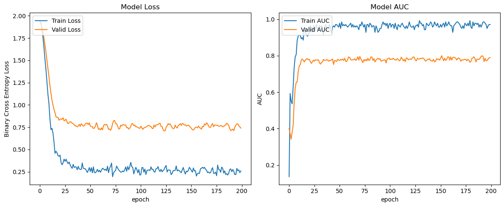
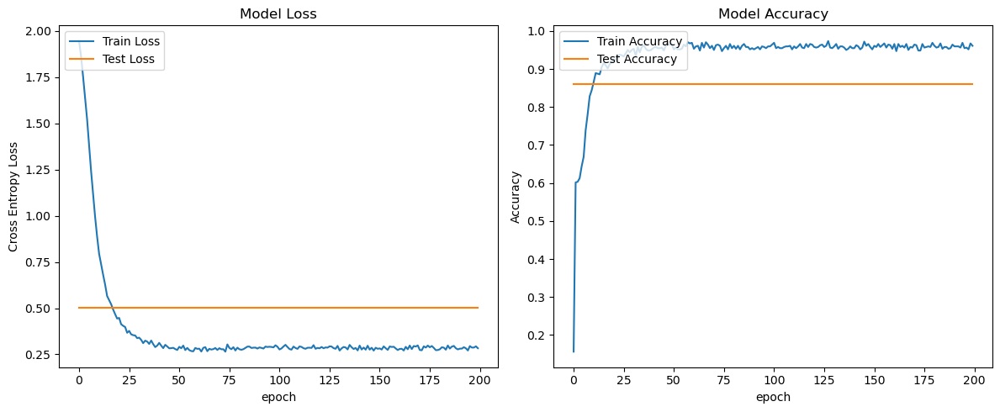
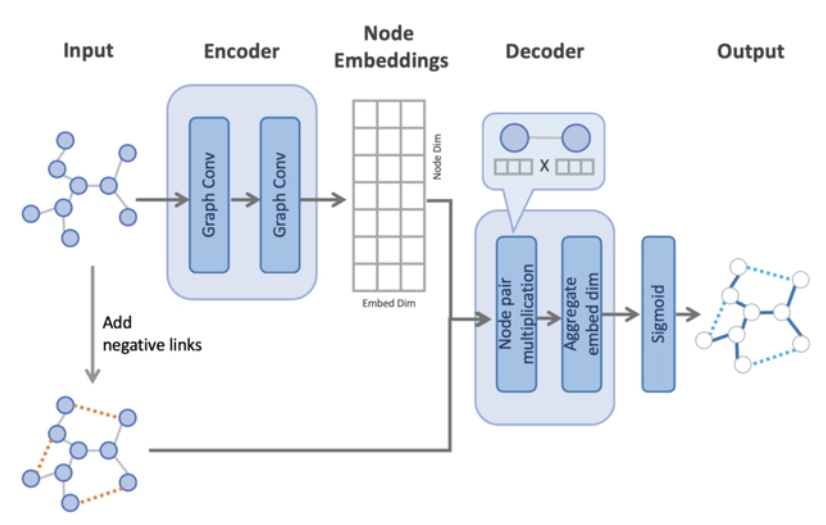
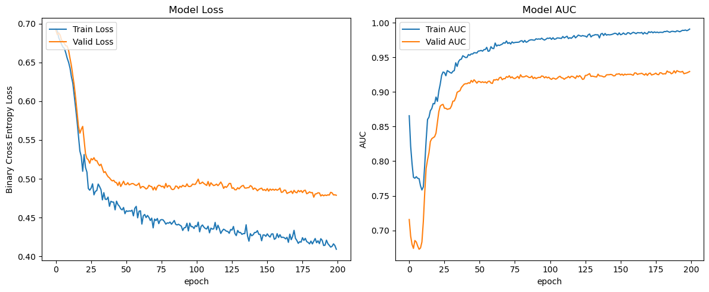
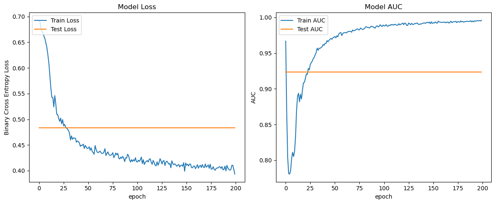

# Lab3 实验报告

PB20111689 蓝俊玮

[TOC]

# 1 节点分类

## 1.1 数据生成

本次实验的数据集为 Cora 数据集。可以通过 PyTorch Geometric 库中的 `Planetoid` 数据集获取，并对数据集进行预处理。

```python
device = torch.device('cuda' if torch.cuda.is_available() else 'cpu')
transform = T.Compose([
    T.NormalizeFeatures(),
    T.ToDevice(device),
])
dataset = Planetoid(root='CORA/', name='Cora', transform=transform)
```

预处理操作包括了：

1. `NormalizeFeatures()`：对数据集中的特征进行标准化，使得特征值的分布更加稳定。
2. `ToDevice(device)`：将数据集中的节点和边转移到指定的设备上，以便在 GPU 上进行加速计算。

在这里不使用 `RandomNodeSplit` 对节点进行划分。原因在于 `RandomNodeSplit` 划分出来的 `train_mask`, `val_mask` 和 `test_mask` 之间是有交集的。最后通过 `Planetoid` 获取 Cora 数据集。由于我是在服务器上运行的，无法从 github 中下载数据集，因此可以预先下载好相应的数据集使用。

## 1.2 模型搭建

本次实验，我将选择 pytorch 作为我的网络框架。

### 1.2.1 图卷积层

任何一个图卷积层都可以写成这样一个非线性函数：

$$
H^{l+1}=f(H^l,A)
$$

其中 $H^0=X$ 为第一层的输入，$X\in R^{N\times D}$，$N$ 为图的节点个数， $D$ 为每个节点特征向量的维度，$A$ 为邻接矩阵。不同模型的差异点在于函数 $f$ 的实现不同。

一种简单的实现方式就是：

$$
H^{l+1}=\sigma(AH^lW^l)
$$

其中 $W^l$ 为第 $l$ 层的权重参数矩阵，$\sigma(\cdot)$ 为非线性激活函数。这种思路是基于节点特征与其所有邻居节点有关的思想。但这样存在两个问题：

- 没有考虑节点自身对自己的影响；
- 邻接矩阵 $A$ 没有被规范化，这在提取图特征时可能存在问题，比如邻居节点多的节点倾向于有更大的影响力。

所以考虑图的拉普拉斯矩阵 $L=D-A$，其中 $D$ 为图的度矩阵。对拉普拉斯矩阵做对称归一化可以得到

$$
L^{\text{sym}}=D^{-\frac{1}{2}}LD^{-\frac{1}{2}}=I-D^{-\frac{1}{2}}AD^{-\frac{1}{2}}
$$

因此图卷积操作现在可以表示成：

$$
H^{l+1}=\sigma(L^{\text{sym}}H^lW^l)=\sigma(D^{-\frac{1}{2}}LD^{-\frac{1}{2}}H^lW^l)
$$

如果考虑有添加自环的图 $\tilde{A}=I+A,\tilde{D}=I+D$，那么任一特征加上自身节点信息的拉普拉斯平滑,则上述图卷积操作可以表示成：

$$
H^{l+1}=\sigma(\tilde{D}^{-\frac{1}{2}}\tilde{A}\tilde{D}^{-\frac{1}{2}}H^lW^l)
$$

则在这个新的实现方法下，它改进了之前的两个问题：

- 引入度矩阵，阻止度大的邻居节点对本节点的影响过大；

- 对邻接矩阵的归一化操作，通过对邻接矩阵两边乘以节点的度开方然后取逆得到。具体到每一个节点对 $i$ 和 $j$，矩阵中的元素由下面的式子给出：

  $$
  L_{ij}^{\text{sym}}:=\begin{cases}1&\text{if }i=j\text{ and}\deg(v_i)\neq0\\ -\frac{1}{\sqrt{\deg(v_i)\deg(v_j)}}&\text{if }i\neq j\text{ and }v_i\text{ is adjacent to }v_j\\ 0&\text{otherwise.}\end{cases}
  $$

上面是以矩阵的形式计算，下面从单个节点的角度来重新看下这些个公式。现在每个节点的更新公式为：

$$
\begin{align}
h_{v_i}^{l+1}&=\sigma(\sum_{j=1}^{n}\frac{1}{c_{ij}}h_{v_j}^{l}W^l)\\
&=\sigma(\sum_{v_k\in\mathcal{N}(v_i)\cup\{v_i\}}\frac{1}{c_{ij}}h_{v_j}^{l}W^l)
\end{align}
$$

其中 $c_{ij}=\sqrt{d_id_j}$。

因此，最后的图卷积层可以定义成：

$$
\mathbf x_i^{(k)}=\sum\limits_{j\in\mathcal N(i)\cup\{i\}}\frac1{\sqrt{\deg(i)}\cdot\sqrt{deg(j)}}\cdot\left(\mathbf{W}\cdot\mathbf x_j^{(k-1)}\right)
$$

其中，将邻居节点特征先通过权重矩阵 $\mathbf{W}$ 进行变换，然后使用节点的度进行归一化，最后再求和。

```python
class MyGCNConv(MessagePassing):
    def __init__(self, in_channels, out_channels, add_self_loops=True):
        super(MyGCNConv, self).__init__(aggr='add')  # "Add" aggregation.
        self.add_self_loops = add_self_loops
        self.linear = Linear(in_channels, out_channels, bias=False, weight_initializer='glorot')

    def forward(self, x, edge_index):
        # Step 1: Add self-loops to the adjacency matrix.
        if self.add_self_loops:
            edge_index, _ = add_self_loops(edge_index, num_nodes=x.size(0))
        # Step 2: Linearly transform node feature matrix.
        x = self.linear(x)
        # Step 3-5: Start propagating messages.
        return self.propagate(edge_index, size=(x.size(0), x.size(0)), x=x)

    def message(self, x_j, edge_index, size):
        # Step 3: Normalize node features.
        row, col = edge_index
        deg = degree(row, size[0], dtype=x_j.dtype)  # [N, ]
        deg_inv_sqrt = deg.pow(-0.5)   # [N, ]
        norm = deg_inv_sqrt[row] * deg_inv_sqrt[col]

        return norm.view(-1, 1) * x_j

    def update(self, aggr_out):
        # Step 5: Return new node embeddings.
        return aggr_out
```

该卷积层从类 `MessagePassing` 进行继承，使用 `add` 的聚合方式，网络每层之间的操作在 `forward()` 函数里面进行实现。在 `forward()` 函数中，首先通过参数决定是否通过 `add_self_loops()` 增加节点的自连接，然后使用线性变换函数 `Linear()` 对节点特征进行变换。之后再调用 `propagate()` 函数，在该函数内部会调用 `message()` 函数和 `update()` 函数，分别进行信息产生以及更新操作。

在 `message()` 函数中，会实现邻居节点的特征向量 $x_j$ 的归一化，最后在 `update()` 函数中，会返回信息聚合的输出。


### 1.2.2 图卷积网络

```python
class GCN4NODE(torch.nn.Module):
    def __init__(self, in_channels, n_layers=2, pair_norm=False, 
                 activation="relu", add_self_loops=True, drop_edge=0.1):
        super(GCN4NODE, self).__init__()
        # initial process
        # ......
        hidden_size = 16
        for i in range(1, self.n_layers + 1):
            in_channels = in_channels if i == 1 else hidden_size
            out_channels = self.out_channels if i == self.n_layers else hidden_size
            self.net.append(MyGCNConv(in_channels, out_channels, self.add_self_loops))

    def forward(self, x, edge_index):
        edge_index, _ = dropout_edge(edge_index, p=self.drop_edge, force_undirected=True)
        for i, conv in enumerate(self.net):
            x = conv(x, edge_index)
            if self.pair_norm:
                x = self.PairNorm(x)
            if i + 1 < self.n_layers:
                x = self.activation(x)
                x = self.dropout(x)
        x = self.log_softmax(x)
        return x
```

这段代码实现了一个 `GCN4NODE` 模型类，用于执行基于图卷积神经网络 (GCN) 的节点分类任务。

在初始化函数中，模型接受以下参数：

- `in_channels`：输入节点特征的维度；
- `n_layers`：图卷积层数，默认为2层；
- `pair_norm`：是否使用 `PairNorm` 技术，默认为 `False`；
- `activation`：激活函数类型，包括 `ReLU`、`LeakyReLU`、`Tanh` 和 `Sigmoid`，默认为 `ReLU`；
- `add_self_loops`：是否为图中的每个节点添加自环边，默认为 `True`；
- `drop_edge`：边丢弃率，用于 DropEdge 正则化，默认为 `0.1`；

在模型的前向传播函数中，首先使用 `dropout_edge` 函数对边进行 DropEdge 操作。然后，对于网络中的每个图卷积层，都将输入节点特征 `x` 和边索引 `edge_index` 传递给图卷积层进行计算。如果 `pair_norm` 为 `True`，则在图卷积层计算后使用 `PairNorm` 对节点特征进行归一化。然后对节点特征进行激活函数和 Dropout 操作。最后，将节点特征传递给 `LogSoftmax` 对象，计算输出的节点类别的概率值，并将其返回。

## 1.3 模型训练

模型训练采用的是留出法进行模型的训练和评估。模型训练的轮数 `epoch = 200`，优化器使用的是 `Adam` 优化器，设置其初始学习率为 `0.1` 且为其正则化设置了 `weight_decay = 1e-5`，损失函数使用的是交叉熵函数。在模型每一轮的训练时，我们会记录其训练集损失值和训练集准确率以及验证集损失值和验证集准确率。

```python
def train_valid_node(estimator, dataset, n_epochs=200, verbose=False):
    device = torch.device('cuda' if torch.cuda.is_available() else 'cpu')
    model = copy.deepcopy(estimator).to(device)
    dataset = dataset.to(device)
    optimizer = torch.optim.Adam(model.parameters(), lr=0.1, weight_decay=5e-4)
    criterion = nn.CrossEntropyLoss()
    
    for epoch in range(1, n_epochs + 1):
        model.train()
        optimizer.zero_grad()
        pred = model(dataset.x, dataset.edge_index)
        train_loss = criterion(pred[dataset.train_mask], dataset.y[dataset.train_mask])
        train_loss.backward()
        optimizer.step()
        pred_label = pred.argmax(dim=1)
        train_correct = (pred_label[dataset.train_mask] == dataset.y[dataset.train_mask]).sum()
        train_acc = int(train_correct) / int(dataset.train_mask.sum())

        model.eval()
        with torch.no_grad():
            pred = model(dataset.x, dataset.edge_index)
            val_loss = criterion(pred[dataset.val_mask], dataset.y[dataset.val_mask])
            pred_label = pred.argmax(dim=1)
            val_correct = (pred_label[dataset.val_mask] == dataset.y[dataset.val_mask]).sum()
            val_acc = int(val_correct) / int(dataset.val_mask.sum())
```

在训练的过程，使用的是 `train_mask`，而在验证的过程中，使用的是 `val_mask`。由于预测的输出是由 `log_softmax()` 得到的概率值，因此需要通过 `pred_label = pred.argmax(dim=1)` 选出概率值最大的类别作为其预测的类别。

首先采用默认设置的参数进行训练：

```python
in_channels = dataset[0].num_node_features
train_losses, train_accs, valid_losses, valid_accs = train_valid_node(
    GCN4NODE(in_channels=in_channels, n_layers=2, 
             pair_norm=False, activation="relu", 
             add_self_loops=True, drop_edge=0.1), 
    dataset[0], n_epochs=200, verbose=True)
```

可以得到训练和验证结果 (最后一轮)：

| 训练损失值 | 验证损失值 | 训练准确率 | 验证准确率 |
| :--------: | :--------: | :--------: | :--------: |
|   0.2592   |   0.7406   |   0.9714   |   0.7900   |



## 1.4 模型调参

**在下面的表述中，将 Self Loop 表示为 s，Network Depth 表示为 n，DropEdge 表示为 d，PairNorm 表示为 p，Activation Function 表示为 a**

因为在调参的过程中发现，只对一个参数进行调整并不是好的选择。所以在本次实验中，采用网格调参法将所有的参数组合起来，从而搜索出一个最适合的参数组合。并且在接下来的报告中，会比较不同参数组合之间的性能差异。我们只关注在目标参数上变化带来的影响。

### 1.4.1 Self Loop

通过对比在不同层数下的是否添加自环 (d = 0.1, a = "relu")：

|        Model         | 训练损失值 | 验证损失值 | 训练准确率 | 验证准确率 |
| :------------------: | :--------: | :--------: | :--------: | :--------: |
| s = 1, p = 0, n = 1  |   1.4501   |   1.6885   |   0.9357   |   0.6940   |
| s = 0, p = 0, n = 1  |   1.4816   |   1.7383   |   0.9071   |   0.6200   |
| s = 1, p = 0, n = 2  |   0.2143   |   0.7414   |   0.9786   |   0.7860   |
| s = 0, p = 0, n = 2  |   0.3814   |   0.8149   |   0.8929   |   0.7600   |
| s = 1, p = 1, n = 5  |   1.2487   |   1.5113   |   0.8286   |   0.6680   |
| s = 0, p = 1, n = 5  |   1.4066   |   1.6534   |   0.6071   |   0.4840   |
| s = 1, p = 1, n = 10 |   1.6383   |   1.6497   |   0.3500   |   0.2900   |
| s = 0, p = 1, n = 10 |   1.8755   |   1.8282   |   0.2714   |   0.2680   |

我们比较了不同层数下是否添加自环对模型性能的影响。从表中可以看出，在不同网络深度的情况下，加自环的模型在训练损失值、验证损失值、训练准确率和验证准确率上均优于不加自环的模型。

图卷积层中的对称化拉普拉斯矩阵的特征值会在叠加多层图卷积层操作后出现数值不稳定和梯度爆炸的问题，因此添加自环后，归一化后的拉普拉斯矩阵的最大特征值会变小，因此会在一定程度上缓解梯度更新出现的问题。所以在深层网络下，加自环的效果比较好。

同时图卷积中加自环是为了更好地利用节点自身的信息，从而提高模型的表现。在图卷积中，节点的特征是由其自身特征和邻居节点特征加权求和得到的。如果不考虑节点自身特征，那么模型就无法利用这一重要信息。并且在一些情况下，加入自环可以提高模型的稳定性，避免模型过于依赖邻居的节点特征，从而提高模型的泛化能力。

总的来说，加自环对于图卷积神经网络的性能和稳定性有着一定的积极影响。

### 1.4.2 Network Depth

由于在不同层数下，对 PairNorm 的需求不一样。因此在分别使用和不使用 PairNorm 的情况下进行比较 (s = 1, d = 0.1, a = "relu")：

|     Model     | 训练损失值 | 验证损失值 | 训练准确率 | 验证准确率 |
| :-----------: | :--------: | :--------: | :--------: | :--------: |
| p = 0, n = 1  |   1.4501   |   1.6885   |   0.9357   |   0.6940   |
| p = 0, n = 2  |   0.2143   |   0.7414   |   0.9786   |   0.7860   |
| p = 0, n = 3  |   0.3066   |   0.9413   |   0.9286   |   0.7700   |
| p = 1, n = 5  |   1.2487   |   1.5113   |   0.8286   |   0.6680   |
| p = 1, n = 10 |   1.6383   |   1.6497   |   0.3500   |   0.2900   |

我们比较了不同层数对图卷积网络性能的影响。从表中可以看出，随着网络深度的增加，模型的性能在一定程度上有所提高。但是，当网络深度增加到一定程度时，模型的性能开始下降。具体来说，当网络深度为1时，模型的性能较差，可能是因为模型无法捕获节点之间的高阶关系。当网络深度为 $2$ 时，模型的性能得到了显著提高，可能是因为模型可以更好地捕捉节点之间的交互信息。网络深度进一步增加到 $3$ 时，模型性能有小幅度下降。但是当网络深度增加到 $5$ 时，模型的性能开始下降，可能是因为过深的网络容易出现梯度消失或梯度爆炸的问题。当网络深度进一步增加到 $10$ 时，模型性能急剧下降。

需要注意的是，在使用 PairNorm 时，对网络深度的选择可能有所不同。PairNorm 是一种归一化技术，可以帮助缓解深层网络中出现的梯度问题，从而提高模型的稳定性。因此，在使用 PairNorm 的情况下，可以更深地堆叠卷积层，以获得更好的性能和更高的稳定性。

### 1.4.3 DropEdge

通过对比在不同层数下的设置的丢弃率 (s = 1, a = "relu")：

|         Model         | 训练损失值 | 验证损失值 | 训练准确率 | 验证准确率 |
| :-------------------: | :--------: | :--------: | :--------: | :--------: |
|  p = 0, n = 2, d = 0  |   0.1909   |   0.7338   |   0.9857   |   0.7900   |
| p = 0, n = 2, d = 0.1 |   0.2143   |   0.7414   |   0.9786   |   0.7860   |
| p = 0, n = 2, d = 0.2 |   0.2703   |   0.7606   |   0.9429   |   0.7780   |
| p = 0, n = 2, d = 0.5 |   0.3003   |   0.8232   |   0.9429   |   0.7380   |
| p = 0, n = 2, d = 0.8 |   0.4164   |   1.0442   |   0.8643   |   0.6680   |
|  p = 1, n = 5, d = 0  |   1.0927   |   1.5415   |   0.8714   |   0.6380   |
| p = 1, n = 5, d = 0.1 |   1.2487   |   1.5113   |   0.8286   |   0.6680   |
| p = 1, n = 5, d = 0.2 |   1.2787   |   1.5949   |   0.7357   |   0.4820   |
| p = 1, n = 5, d = 0.5 |   1.4808   |   1.7046   |   0.5429   |   0.3860   |
| p = 1, n = 5, d = 0.8 |   1.5928   |   1.7017   |   0.4286   |   0.3560   |

我们比较了在不同层数下使用不同的 DropEdge 丢弃率对图卷积网络性能的影响。从表中可以看出，当丢弃率较低时，模型的性能较好，当丢弃率较高时，模型的性能开始下降。

DropEdge 是一种随机丢弃边的技术，可以帮助模型减少过拟合和提高泛化能力。在使用 DropEdge 的情况下，较低的丢弃率通常会产生更好的性能和更高的稳定性。但是，如果丢弃率过高，可能会导致信息损失和不稳定的训练过程。可以看到，DropEdge 可以改善模型的过拟合现象，但是在本次实验中，DropEdge 并没有明显的体现出对模型泛化能力的提高。在低层数的时候，使用 DropEdge 效果会好于高层数的情况。

### 1.4.4 PairNorm

通过对比在不同层数下是否使用 PairNorm 技术 (s = 1, d = 0.1, a = "relu")：

|     Model     | 训练损失值 | 验证损失值 | 训练准确率 | 验证准确率 |
| :-----------: | :--------: | :--------: | :--------: | :--------: |
| p = 0, n = 1  |   1.4501   |   1.6885   |   0.9357   |   0.6940   |
| p = 1, n = 1  |   0.3495   |   1.7854   |   1.0000   |   0.3680   |
| p = 0, n = 2  |   0.2143   |   0.7414   |   0.9786   |   0.7860   |
| p = 1, n = 2  |   0.7101   |   1.6519   |   0.9643   |   0.4940   |
| p = 0, n = 3  |   0.3066   |   0.9413   |   0.9286   |   0.7700   |
| p = 1, n = 3  |   0.9393   |   1.5393   |   0.9071   |   0.6140   |
| p = 0, n = 5  |   0.6116   |   1.3603   |   0.7786   |   0.6000   |
| p = 1, n = 5  |   1.2487   |   1.5113   |   0.8286   |   0.6680   |
| p = 0, n = 10 |   1.9459   |   1.9459   |   0.1429   |   0.1220   |
| p = 1, n = 10 |   1.6383   |   1.6487   |   0.3500   |   0.2900   |

我们比较了在不同层数下使用 PairNorm 技术对图卷积网络性能的影响。从表中可以看出，在高层数的网络中使用 PairNorm 技术可以显著提高模型的性能和稳定性。

从表中可以看出，在低层数的网络中使用 PairNorm 效果并不是很好，而在高层数的网络中使用 PairNorm 效果比较好。PairNorm 旨在缓解深度网络中的梯度问题，提高模型的稳定性和性能。在图卷积神经网络中，不同节点的度数可能会差异较大，这会导致在网络层之间传递的信息被不同的尺度所影响，从而导致梯度消失或爆炸的问题。PairNorm 技术通过对每对节点之间的特征进行归一化，使得每个节点在计算过程中受到相同的尺度影响，从而缓解了深层网络中的梯度问题。因此在高层数的表现会比较好，同时在 PairNorm 的帮助下，通常可以更深地堆叠网络层，以获得更好的性能和更高的稳定性。而在低层数的网咯中，梯度传递问题的影响相对较小，此时 PairNorm 技术对于缓解梯度问题的作用相对较小，甚至会引入一些额外的噪声或不稳定性，因此严重影响了模型的性能表现。

### 1.4.5 Activation Function

通过对比在不同层数下使用不同的激活函数 (s = 1, d = 0.1)：

|             Model              | 训练损失值 | 验证损失值 | 训练准确率 | 验证准确率 |
| :----------------------------: | :--------: | :--------: | :--------: | :--------: |
|    p = 0, n = 2, a = "relu"    |   0.2143   |   0.7414   |   0.9786   |   0.7860   |
| p = 0, n = 2, a = "leaky_relu" |   0.2500   |   0.7787   |   0.9571   |   0.7700   |
|    p = 0, n = 2, a = "tanh"    |   0.1760   |   0.7594   |   1.0000   |   0.7820   |
|  p = 0, n = 2, a = "sigmoid"   |   1.9872   |   1.9478   |   0.1429   |   0.1220   |
|    p = 1, n = 5, a = "relu"    |   1.2487   |   1.5113   |   0.8286   |   0.6680   |
| p = 1, n = 5, a = "leaky_relu" |   1.1469   |   1.5113   |   0.8857   |   0.6600   |
|    p = 1, n = 5, a = "tanh"    |   1.1891   |   1.5955   |   0.9000   |   0.5900   |
|  p = 1, n = 5, a = "sigmoid"   |   1.9379   |   1.8861   |   0.1571   |   0.2320   |

我们比较了在不同层数下使用不同激活函数对图卷积网络性能的影响。从表中可以看出，不同的激活函数对于模型的性能和稳定性有着显著的影响。

在网络深度比较低的时候，relu, leaky_relu 和 tanh 激活函数的表现性能都差不多，sigmoid 激活函数的表现性能很差；而当网络深度高的时候，relu 和 leaky_relu 激活函数的表现性能都差不多，然后 tanh 的表现性能其次，然后 sigmoid 激活函数的表现性能依然很差。

不同的激活函数具有不同的性质和特点：relu 激活函数具有简单、快速、稳定的特点，适用于大多数情况下。leaky_relu 激活函数可以缓解梯度消失问题，提高模型的稳定性和泛化能力。tanh 激活函数具有连续可导、输出值范围为 $(-1, 1)$ 的特点，适用于需要将输出映射到一定范围内的情况。sigmoid 激活函数也具有连续可导的特点，但其输出值范围为 $(0, 1)$，可能会导致梯度消失或梯度爆炸的问题，因此在图卷积这个模型下，sigmoid 的表现性能并不是很好。

## 1.5 性能测试

通过网格调参法的运行结果，得到的最优参数组合为：

```python
n_layers = 2
pair_norm = False
activation = "tanh"
add_self_loops = True
drop_edge = 0
```

然后训练的使用将 `train_mask` 和 `val_mask` 合并起来，测试的时候使用 `test_mask`

```python
mask = dataset1.train_mask | dataset1.val_mask
```

得到的训练结果为：

| 训练损失值 | 测试损失值 | 训练准确率 | 测试准确率 |
| :--------: | :--------: | :--------: | :--------: |
|   0.2834   |   0.5036   |   0.9609   |   0.8600   |



# 2 链路预测

## 2.1 数据生成

本次实验的数据集为 Cora 数据集。可以通过 PyTorch Geometric 库中的 `Planetoid` 数据集获取，并对数据集进行预处理。

```python
device = torch.device('cuda' if torch.cuda.is_available() else 'cpu')
transform = T.Compose([
    T.NormalizeFeatures(),
    T.ToDevice(device),
    T.RandomLinkSplit(num_val=0.1, num_test=0.1, 
                      is_undirected=True, add_negative_train_samples=False),
])
dataset = Planetoid(root='CORA/', name='Cora', transform=transform)
train_data, val_data, test_data = dataset[0]
```

预处理操作包括了：

1. `NormalizeFeatures()`：对数据集中的特征进行标准化，使得特征值的分布更加稳定。
2. `ToDevice(device)`：将数据集中的节点和边转移到指定的设备上，以便在 GPU 上进行加速计算。
3. `RandomLinkSplit()`：将数据集划分为训练集、验证集和测试集。

因为在链路预测的问题中，我们只关心链路的预测结果，即有或者没有，该问题是一个二分类问题。因此我们不必考虑图中的有向边关系，因此将 `is_undirected` 设置成 `True`。同时设置 `add_negative_train_samples` 为 `False`，我们将在后面每一轮训练中重新采样出新的负训练样本加到边中。而在这个 `RandomLinkSplit()` 函数会自动为验证集和测试集增加负样本，因此验证集和测试集不需要我们对其进行采样操作。 

最后输出的划分数据中会添加两个新属性 `edge_label` 和 `edge_label_index`，其中 `edge_label_index` 用于解码器进行预测，而 `edge_label` 将用于模型评估。而原有的数据 `x` 和 `edge_index` 会被编码器用来创建节点嵌入。

## 2.2 模型搭建

本次实验，我将选择 pytorch 作为我的网络框架。由于使用的图卷积层操作是相同的，因此不再介绍。

对于链路预测所使用的模型是基于编码器和解码器的架构进行。编码器通过图卷积操作来创建节点嵌入。解码器使用节点嵌入对所有边 (包括负链接) 进行链接预测。它从每条边上的一对节点计算节点嵌入的点积。 然后聚合整个嵌入维度的值，并在每条边上创建一个表示边存在概率的值。



```python
class GCN4LINK(torch.nn.Module):
    def encode(self, x, edge_index):
        edge_index, _ = dropout_edge(edge_index, p=self.drop_edge, force_undirected=True)
        for i, conv in enumerate(self.net):
            x = conv(x, edge_index)
            if self.pair_norm:
                x = self.PairNorm(x)
            if i + 1 < self.n_layers:
                x = self.activation(x)
                x = self.dropout(x)
        return x

    def decode(self, z, edge_label_index):
        return (z[edge_label_index[0]] * z[edge_label_index[1]]).sum(dim=-1)
```

- 编码部分 `encode(x, edge_index)`：将输入的节点特征 `x` 和邻接矩阵 `edge_index` 作为输入，通过多层图卷积神经网络进行特征编码。其整体实现与节点分类的模型一致。
- 解码部分 `decode(z, edge_label_index)`：将编码后的节点特征 `z` 和边标签的索引 `edge_label_index` 作为输入，通过元素相乘和求和的方式计算出边的得分。具体来说，首先根据边标签的索引从编码后的节点特征 `z` 中获取连接两个节点的特征向量，然后将这两个特征向量按元素相乘的方式进行计算，得到一个长度为特征维度的向量。最后，通过对这个向量进行求和操作，得到边的得分。这个得分可以用于预测边的类型或边的权重等。

## 2.3 模型训练

模型训练采用的是留出法进行模型的训练和评估。模型训练的轮数 `epoch = 200`，优化器使用的是 `Adam` 优化器，设置其初始学习率为 `0.1` 且为其正则化设置了 `weight_decay = 1e-5`，损失函数使用的是 `BCEWithLogitsLoss` 函数。这个损失函数是在二元交叉熵函数的基础上增加了 `Sigmoid` 选项，即先把输入经过一个 `Sigmoid`，然后再计算二元交叉熵损失值 `BCELoss`。

在模型每一轮的训练时，我们会记录其训练集损失值和训练集准确率以及验证集损失值和验证集准确率。

```python
def train_valid_link(estimator, train_data, val_data, n_epochs=200, verbose=False):
    device = torch.device('cuda' if torch.cuda.is_available() else 'cpu')
    model = copy.deepcopy(estimator).to(device)
    train_data = train_data.to(device)
    val_data = val_data.to(device)
    optimizer = torch.optim.Adam(model.parameters(), lr=0.01)
    criterion = torch.nn.BCEWithLogitsLoss()

    for epoch in range(1, n_epochs + 1):
        model.train()
        optimizer.zero_grad()
        z = model.encode(train_data.x, train_data.edge_index)

        # We perform a new round of negative sampling for every training epoch:
        neg_edge_index = negative_sampling(edge_index=train_data.edge_index, num_nodes=train_data.num_nodes,
            num_neg_samples=train_data.edge_label_index.size(1), method='sparse')

        edge_label_index = torch.cat([train_data.edge_label_index, neg_edge_index], dim=-1,)
        edge_label = torch.cat([train_data.edge_label, train_data.edge_label.new_zeros(neg_edge_index.size(1))], dim=0)
        
        pred = model.decode(z, edge_label_index).view(-1)
        train_loss = criterion(pred, edge_label)
        train_loss.backward()
        optimizer.step()
        pred_label = pred.sigmoid()
        train_auc = roc_auc_score(edge_label.cpu().detach().numpy(), pred_label.detach().cpu().numpy())
        
        model.eval()
        with torch.no_grad():
            z = model.encode(val_data.x, val_data.edge_index)
            pred = model.decode(z, val_data.edge_label_index).view(-1)
            val_loss = criterion(pred, val_data.edge_label)
            pred_label = pred.sigmoid()
            val_auc = roc_auc_score(val_data.edge_label.cpu().numpy(), pred_label.cpu().numpy())
```

链接预测训练过程中的每一轮我们都需要对训练集进行采样以得到与正样本数量相同的负样本，而验证集和测试集在数据集划分阶段已经进行了负采样，因此不必再进行采样。将采样得到的负样本合并的正样本当中。

```python
# We perform a new round of negative sampling for every training epoch:
neg_edge_index = negative_sampling(edge_index=train_data.edge_index, num_nodes=train_data.num_nodes,
    num_neg_samples=train_data.edge_label_index.size(1), method='sparse')

edge_label_index = torch.cat([train_data.edge_label_index, neg_edge_index], dim=-1,)
edge_label = torch.cat([train_data.edge_label, train_data.edge_label.new_zeros(neg_edge_index.size(1))], dim=0)
```

由于该问题是二分类问题，因此在通过解码器得到预测概率结果后，可以使用 `sigmoid` 函数获取其预测结果：

```python
pred = model.decode(z, edge_label_index).view(-1)
pred_label = pred.sigmoid()
```

那么，在图卷积模型操作下，一条无向链路存在的概率就可以表示为：

$$
P(AB)=\sigma(\mathbf{v}_a\cdot\mathbf{v}_b)
$$

其中 $\mathbf{v}_a$ 和 $\mathbf{v}_b$ 是节点 A 和 B 通过编码器得到的特征嵌入，然后解码器通过计算节点嵌入的点积， 然后聚合整个嵌入维度的值，由此得到链路预测的概率值。通过非线性激活函数 $\sigma(\cdot)$ `sigmoid` 函数，便可以得到链路预测的结果 `pred_label`。

首先采用默认设置的参数进行训练：

```python
train_losses, train_aucs, valid_losses, valid_aucs = train_valid_link(
    GCN4LINK(in_channels=dataset.num_features, n_layers=2, 
             pair_norm=False, activation="relu", 
             add_self_loops=True, drop_edge=0.1),
    train_data, val_data, n_epochs=200, verbose=True)
```

可以得到训练和验证结果 (最后一轮)：

| 训练损失值 | 验证损失值 | 训练AUC | 验证AUC |
| :--------: | :--------: | :-----: | :-----: |
|   0.4093   |   0.4788   | 0.9909  | 0.9295  |



## 2.4 模型调参

**在下面的表述中，将 Self Loop 表示为 s，Network Depth 表示为 n，DropEdge 表示为 d，PairNorm 表示为 p，Activation Function 表示为 a**

因为在调参的过程中发现，只对一个参数进行调整并不是好的选择。所以在本次实验中，采用网格调参法将所有的参数组合起来，从而搜索出一个最适合的参数组合。并且在接下来的报告中，会比较不同参数组合之间的性能差异。我们只关注在目标参数上变化带来的影响。

### 2.4.1 Self Loop

通过对比在不同层数下的是否添加自环 (d = 0.1, a = "relu")：

|        Model         | 训练损失值 | 验证损失值 | 训练AUC | 验证AUC |
| :------------------: | :--------: | :--------: | :-----: | :-----: |
| s = 1, p = 0, n = 1  |   0.4528   |   0.4791   | 0.9631  | 0.9305  |
| s = 0, p = 0, n = 1  |   0.4743   |   0.5388   | 0.9451  | 0.8504  |
| s = 1, p = 0, n = 2  |   0.4323   |   0.4897   | 0.9787  | 0.9179  |
| s = 0, p = 0, n = 2  |   0.4567   |   0.6096   | 0.9571  | 0.8718  |
| s = 1, p = 1, n = 5  |   0.4926   |   0.5390   | 0.9408  | 0.8645  |
| s = 0, p = 1, n = 5  |   0.5304   |   0.5959   | 0.8800  | 0.7799  |
| s = 1, p = 1, n = 10 |   0.5241   |   0.5763   | 0.9019  | 0.7849  |
| s = 0, p = 1, n = 10 |   0.5652   |   0.6351   | 0.8219  | 0.7416  |

我们比较了不同层数下是否添加自环对模型性能的影响。从表中可以看出，在不同网络深度的情况下，加自环的模型在训练AUC和验证AUC上均优于不加自环的模型。

图卷积层中的对称化拉普拉斯矩阵的特征值会在叠加多层图卷积层操作后出现数值不稳定和梯度爆炸的问题，因此添加自环后，归一化后的拉普拉斯矩阵的最大特征值会变小，因此会在一定程度上缓解梯度更新出现的问题。所以在深层网络下，加自环的效果比较好。

同时图卷积中加自环是为了更好地利用节点自身的信息，从而提高模型的表现。在图卷积中，节点的特征是由其自身特征和邻居节点特征加权求和得到的。如果不考虑节点自身特征，那么模型就无法利用这一重要信息。并且在一些情况下，加入自环可以提高模型的稳定性，避免模型过于依赖邻居的节点特征，从而提高模型的泛化能力。

总的来说，加自环对于图卷积神经网络的性能和稳定性有着一定的积极影响。

### 2.4.2 Network Depth

由于在不同层数下，对 PairNorm 的需求不一样。因此在分别使用和不使用 PairNorm 的情况下进行比较 (s = 1, d = 0.1, a = "relu")：

|     Model     | 训练损失值 | 验证损失值 | 训练AUC | 验证AUC |
| :-----------: | :--------: | :--------: | :-----: | :-----: |
| p = 0, n = 1  |   0.4528   |   0.4791   | 0.9631  | 0.9305  |
| p = 0, n = 2  |   0.4323   |   0.4897   | 0.9787  | 0.9179  |
| p = 0, n = 3  |   0.4340   |   0.5026   | 0.9782  | 0.9119  |
| p = 1, n = 5  |   0.4926   |   0.5390   | 0.9408  | 0.8645  |
| p = 1, n = 10 |   0.5241   |   0.5763   | 0.9019  | 0.7849  |

我们比较了不同层数对图卷积网络性能的影响。从表中可以看出，随着网络深度的增加，模型的性能在一定程度上有所提高。但是当网络深度不断增加时，模型的性能不断下降，可能是因为过深的网络容易出现梯度消失或梯度爆炸的问题。

但是与节点分类问题不同的是，其模型性能下降的幅度并不是很大，可能是因为在链路预测任务中，每条边的标签只有两种情况，相比于节点分类任务，数据的复杂性更低。因此，在链路预测任务中，即使网络较深，模型也能够较好地学习到节点之间的关系，从而提高模型性能。此外，链路预测任务的数据规模通常比节点分类任务小得多，这也有助于缓解过拟合和梯度消失的问题。因此，与节点分类任务不同，链路预测任务中的图卷积网络可能比较容易处理深层次的网络结构。

### 2.4.3 DropEdge

通过对比在不同层数下的设置的丢弃率 (s = 1, a = "relu")：

|         Model         | 训练损失值 | 验证损失值 | 训练AUC | 验证AUC |
| :-------------------: | :--------: | :--------: | :-----: | :-----: |
|  p = 0, n = 2, d = 0  |   0.4325   |   0.4831   | 0.9815  | 0.9225  |
| p = 0, n = 2, d = 0.1 |   0.4323   |   0.4897   | 0.9787  | 0.9179  |
| p = 0, n = 2, d = 0.2 |   0.4413   |   0.4795   | 0.9730  | 0.9274  |
| p = 0, n = 2, d = 0.5 |   0.4554   |   0.4900   | 0.9600  | 0.9197  |
| p = 0, n = 2, d = 0.8 |   0.4692   |   0.5031   | 0.9473  | 0.9086  |
|  p = 1, n = 5, d = 0  |   0.4898   |   0.5389   | 0.9481  | 0.8667  |
| p = 1, n = 5, d = 0.1 |   0.4926   |   0.5390   | 0.9408  | 0.8645  |
| p = 1, n = 5, d = 0.2 |   0.5011   |   0.5376   | 0.9269  | 0.8556  |
| p = 1, n = 5, d = 0.5 |   0.5194   |   0.5597   | 0.8970  | 0.8290  |
| p = 1, n = 5, d = 0.8 |   0.5549   |   0.5919   | 0.8373  | 0.7832  |

我们比较了在不同层数下使用不同的 DropEdge 丢弃率对图卷积网络性能的影响。从表中可以看出，随着丢弃率的增加，模型的训练损失和验证损失都有所增加，同时训练AUC和验证AUC都有所下降。这是因为丢弃边会减少网络的有效连接，从而减少了网络的学习能力，并可能导致一些关键信息的丢失。但是在一定范围内，适当的丢弃边可以防止模型过拟合，并提高模型的泛化性能。但是，如果丢弃率过高，可能会导致信息损失和不稳定的训练过程。

### 2.4.4 PairNorm

通过对比在不同层数下是否使用 PairNorm 技术 (s = 1, d = 0.1, a = "relu")：

|     Model     | 训练损失值 | 验证损失值 | 训练AUC | 验证AUC |
| :-----------: | :--------: | :--------: | :-----: | :-----: |
| p = 0, n = 1  |   0.4528   |   0.4791   | 0.9631  | 0.9305  |
| p = 1, n = 1  |   0.4786   |   0.5372   | 0.9852  | 0.9184  |
| p = 0, n = 2  |   0.4323   |   0.4897   | 0.9787  | 0.9179  |
| p = 1, n = 2  |   0.4815   |   0.5275   | 0.9703  | 0.9035  |
| p = 0, n = 3  |   0.4340   |   0.5026   | 0.9782  | 0.9119  |
| p = 1, n = 3  |   0.4848   |   0.5320   | 0.9614  | 0.8888  |
| p = 0, n = 5  |   0.6153   |   0.6337   | 0.8002  | 0.7236  |
| p = 1, n = 5  |   0.4926   |   0.5390   | 0.9408  | 0.8645  |
| p = 0, n = 10 |   0.6910   |   0.6921   | 0.4555  | 0.4844  |
| p = 1, n = 10 |   0.5241   |   0.5763   | 0.9019  | 0.7849  |

我们比较了在不同层数下使用 PairNorm 技术对图卷积网络性能的影响。从表中可以看出，在高层数的网络中使用 PairNorm 技术可以显著提高模型的性能和稳定性。与节点分类问题一样，在低层数的网络中使用 PairNorm 效果并不是很好，而在高层数的网络中使用 PairNorm 效果比较好。

PairNorm 旨在缓解深度网络中的梯度问题，提高模型的稳定性和性能。在图卷积神经网络中，不同节点的度数可能会差异较大，这会导致在网络层之间传递的信息被不同的尺度所影响，从而导致梯度消失或爆炸的问题。PairNorm 技术通过对每对节点之间的特征进行归一化，使得每个节点在计算过程中受到相同的尺度影响，从而缓解了深层网络中的梯度问题。因此在高层数的表现会比较好，同时在 PairNorm 的帮助下，通常可以更深地堆叠网络层，以获得更好的性能和更高的稳定性。而在低层数的网咯中，梯度传递问题的影响相对较小，此时 PairNorm 技术对于缓解梯度问题的作用相对较小，甚至会引入一些额外的噪声或不稳定性，因此严重影响了模型的性能表现。

### 2.4.5 Activation Function

通过对比在不同层数下使用不同的激活函数 (s = 1, d = 0.1)：

|             Model              | 训练损失值 | 验证损失值 | 训练AUC | 验证AUC |
| :----------------------------: | :--------: | :--------: | :-----: | :-----: |
|    p = 0, n = 2, a = "relu"    |   0.4528   |   0.4791   | 0.9631  | 0.9305  |
| p = 0, n = 2, a = "leaky_relu" |   0.4514   |   0.4859   | 0.9633  | 0.9267  |
|    p = 0, n = 2, a = "tanh"    |   0.4528   |   0.4820   | 0.9634  | 0.9286  |
|  p = 0, n = 2, a = "sigmoid"   |   0.4452   |   0.4787   | 0.9672  | 0.9300  |
|    p = 1, n = 5, a = "relu"    |   0.4926   |   0.5390   | 0.9408  | 0.8645  |
| p = 1, n = 5, a = "leaky_relu" |   0.4946   |   0.5350   | 0.9432  | 0.8700  |
|    p = 1, n = 5, a = "tanh"    |   0.4888   |   0.5275   | 0.9482  | 0.8753  |
|  p = 1, n = 5, a = "sigmoid"   |   0.6225   |   1.0446   | 0.8806  | 0.4136  |

我们比较了在不同层数下使用不同激活函数对图卷积网络性能的影响。从表中可以看出，不同的激活函数对于模型的性能和稳定性有着显著的影响。

可以看到，relu, leaky_relu 和 tanh 激活函数的表现性能都差不多，sigmoid 激活函数的表现性能很差。但是在比较的时候还发现了下述信息：

|              Model              | 训练损失值 | 验证损失值 | 训练AUC | 验证AUC |
| :-----------------------------: | :--------: | :--------: | :-----: | :-----: |
|    p = 0, n = 10, a = "relu"    |   0.6910   |   0.6921   | 0.4555  | 0.4844  |
|    p = 1, n = 10, a = "relu"    |   0.5241   |   0.5763   | 0.9019  | 0.7849  |
| p = 0, n = 10, a = "leaky_relu" |   0.6931   |   0.6931   | 0.4683  | 0.5333  |
| p = 1, n = 10, a = "leaky_relu" |   0.5267   |   0.6008   | 0.8934  | 0.7768  |
|    p = 0, n = 10, a = "tanh"    |   0.5305   |   0.5530   | 0.9201  | 0.8665  |
|    p = 1, n = 10, a = "tanh"    |   0.5412   |   0.5934   | 0.8634  | 0.7786  |
|  p = 0, n = 10, a = "sigmoid"   |   0.5718   |   0.6753   | 0.8411  | 0.6751  |
|  p = 1, n = 10, a = "sigmoid"   |   0.6261   |   1.0195   | 0.8691  | 0.4250  |

按理说，在高层数的图卷积网络应该需要使用 PairNorm。但是在这里发现，当使用 relu 和 leaky_relu 作为激活函数时，是符合高层数的图卷积网络需要使用 PairNorm 这个看法的。但是当使用 tanh 和 sigmoid 函数作为激活函数时，发现使用了 PairNorm 之后的性能反而大幅下降。

可能的原因是于 PairNorm 和 tanh, sigmoid 激活函数之间的相互作用导致的。在使用 PairNorm 的情况下，每个节点的特征向量已经被调整为具有单位范数和零均值，因此在之后的层中再次使用非线性激活函数可能会导致信息重复损失，导致 tanh 和 sigmoid 的作用可能会被一定程度上抑制，从而导致性能下降。**而这个现象是在节点分类问题中没有遇到的**。

## 2.5 性能测试

通过网格调参法的运行结果，得到的最优参数组合为：

```python
n_layers = 2
pair_norm = False
activation = "tanh"
add_self_loops = True
drop_edge = 0
```

因为不方便将 `train_data` 和 `val_data` 合并，因此只在 `train_data` 上对模型进行训练。得到的训练结果为：

| 训练损失值 | 测试损失值 | 训练AUC | 测试AUC |
| :--------: | :--------: | :-----: | :-----: |
|   0.3933   |   0.4834   | 0.9959  | 0.9232  |


