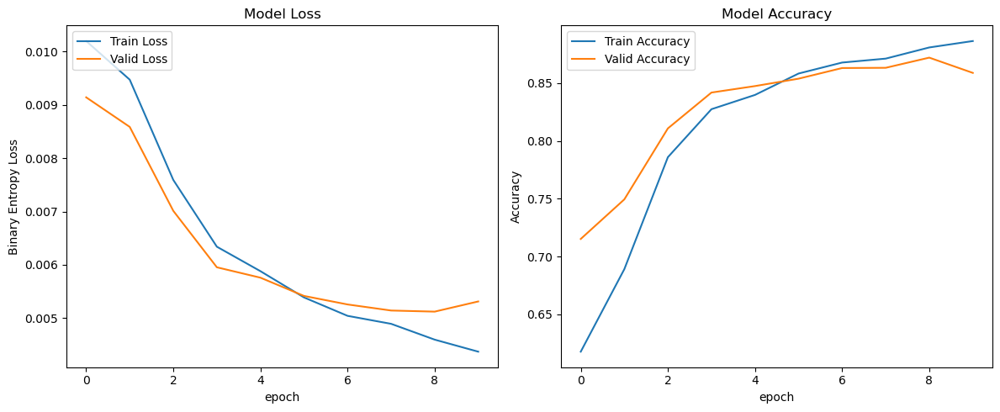
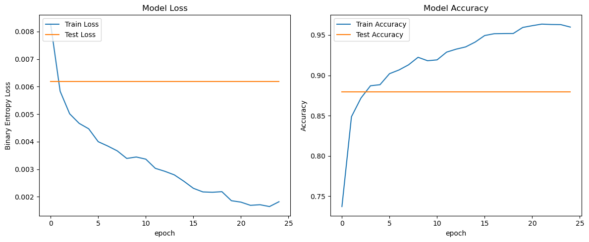
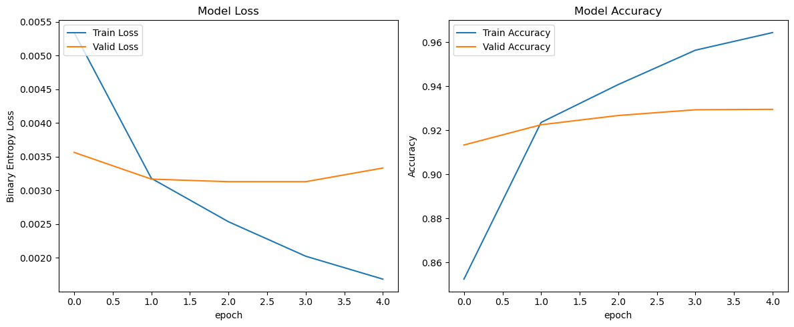
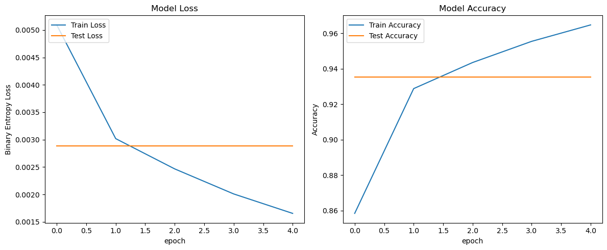

# Lab4 实验报告

PB20111689 蓝俊玮

# 1. RNN/LSTM

## 1.1 数据获取

### 1.1.1 数据读取

在数据集 "Large Movie Review Dataset" 中，包含训练集和测试集两个部分，其中每个数据集中划分成正样例和负样例两个目录，其中分别包含积极和消极情感的电影评论文本。

```python
def read_data(split_dir):
    split_dir = Path(split_dir)
    texts = []
    labels = []
    for label_dir in ["pos", "neg"]:
        for text_file in (split_dir/label_dir).iterdir():
            texts.append(text_file.read_text())
            labels.append(0 if label_dir == "neg" else 1)

    return texts, labels
```

函数 `read_data()` 接受一个参数 `split_dir`，它表示训练或测试数据集的目录路径。代码中通过将 `split_dir` 转换为 `Path` 对象来处理目录路径。函数使用两个空列表 `texts` 和 `labels` 来存储读取的数据。接下来，通过遍历两个标签目录 `"pos"` 和 `"neg"`，分别代表积极和消极的评论，来获取每个文本文件。使用 `iterdir()` 函数遍历 `split_dir/label_dir` 目录中的所有文件。对于每个文本文件，通过 `read_text()` 函数读取其内容，并将其添加到 `texts` 列表中。同时，根据标签目录的名称将 $0$ 或 $1$ 添加到 `labels` 列表中，其中 $0$ 代表消极情感，$1$ 代表积极情感。

最后，函数返回两个列表 `texts` 和 `labels`，包含了数据集中所有电影评论的文本和对应的情感标签。

### 1.1.2 数据处理

本部分使用 `torchtext` 来进行数据预处理工作。`torchtext` 库提供了简单高效的方法来为任务预处理文本数据。对数据进行预处理是为了将文本数据转换为模型可接受的数值表示。这种预处理通常包括两个主要步骤：分词和构建词汇表。

```python
tokenizer = get_tokenizer('basic_english')
tokenized_texts = [tokenizer(text) for text in train_texts]

counter = Counter(token for text in tokenized_texts for token in text)
specials = ['<unk>', '<pad>', '<bos>', '<eos>']
vocab = Vocab(counter, specials=specials)
```

1. 分词：将文本划分为单个的词或子词单元，称为 "token"。分词的目的是将连续的文本序列转换为离散的标记序列，使得模型能够对每个标记进行处理。在上述代码中，使用了 `torchtext.data.utils` 中的 `get_tokenizer` 来获取一个分词器 (`tokenizer` )，并使用该分词器将每个评论文本进行分词操作。这将产生一个包含分词后文本的列表 `tokenized_texts`。
2. 构建词汇表：词汇表是将分词后的标记映射到唯一整数索引的字典。构建词汇表的目的是为了将文本中的标记转换为整数表示，以便输入到模型中进行训练或推理。在给定的代码中，使用 `Counter` 类来统计分词后的标记在文本数据中的频率。然后，使用 `Vocab` 类按照频率来构建词汇表对象 `vocab`，该词汇表将每个标记映射到一个唯一的整数索引。这里还定义了一些特殊的标记 (`<unk>`, `<pad>`, `<bos>`, `<eos>`)，它们用于处理未知标记、填充序列和表示序列的起始和结束。

通过对数据进行这些预处理步骤，可以将原始的文本数据转换为数值表示，使得 RNN/LSTM 模型能够有效地处理和学习文本序列的结构和语义信息。这样做可以：

- 使模型能够更好地理解和表示输入序列。
- 将文本数据表示为整数索引序列可以节省内存和计算资源。
- 使模型更易于训练和优化。

那么经过上述操作，就可以将原始文本分成更小的标记 "token"，并创建标记 "token" 与其在所有标记的词汇表中的索引之间的映射。

### 1.1.3 封装数据

在定义了上述分词器 `tokenizer` 和词汇表 `vocab` 之后，就可以使用 `torch.utils.data` 的 `Dataset` 来定义数据集：

```python
class CustomTextDataset1(Dataset):
    def __init__(self, texts, labels, vocab, tokenizer):
        self.texts = texts
        self.labels = labels
        self.vocab = vocab
        self.tokenizer = tokenizer

    def __getitem__(self, index):
        label = self.labels[index]
        text = self.texts[index]
        numericalized_text = self.numericalize_text(text)
        return numericalized_text, label

    def __len__(self):
        return len(self.labels)
    
    def numericalize_text(self, text):
        return [self.vocab[token] for token in self.tokenizer(text)]
```

`__getitem__()` 方法定义了数据集的索引操作，接受一个索引 `index` 作为参数。在该方法中，根据给定的索引获取相应的标签和文本。然后，通过调用 `numericalize_text()` 方法将文本转换为数值化表示。最后，返回数值化后的文本和标签。

`numericalize_text() ` 方法是一个辅助方法，用于将文本转换为数值化表示。它接受一个文本 `text` 作为输入，并使用预定义的词汇表 `self.vocab` 和分词器 `self.tokenizer` 将文本中的标记转换为对应的整数索引。将每个标记的整数索引存储在一个列表中，并返回该列表。

这个自定义的文本数据集类可以将原始文本数据与预处理步骤 (如分词和数值化) 封装在一起，可以在进行训练和推理时更方便地加载和处理数据。通过使用这个数据集类，可以通过索引操作获取数据集中的样本，并返回数值化后的文本和对应的标签。

```python
dataset = CustomTextDataset1(train_texts, train_labels, vocab, tokenizer)
train_size = int(len(dataset) * 0.8)
val_size = len(dataset) - train_size
train_dataset, val_dataset = random_split(dataset, [train_size, val_size])
```

接着使用 `random_split()` 函数将 `dataset` 数据集随机分割为训练集和验证集，然后可以使用这两个数据集对象进行模型的训练和评估。

然后为了让数据 batch 中的样本具有相同的形状，下面定义 `collate_batch()` 函数来对批量数据进行处理和组装：

```python
def collate_batch(batch):
    device = torch.device("cuda" if torch.cuda.is_available() else "cpu")
    label_list, text_list = [], []
    for (_text, _label) in batch:
        label_list.append(_label)
        text_list.append(torch.tensor(_text))
    padded_text = pad_sequence(text_list, batch_first=False, padding_value=1.0)
    return torch.tensor(label_list, dtype=torch.float64).to(device), padded_text.to(device)
```

通过迭代批量数据 `batch`，其中每个元素是一个元组 `(_text, _label)`，将标签和文本数据分别添加到 `label_list` 和 `text_list` 中。其中使用 `torch.nn.utils.rnn` 的 `pad_sequence()` 函数对 `text_list` 中的文本数据进行填充操作，将序列长度对齐到最长的文本序列。其中，`batch_first=False` 表示填充后的张量维度为`(sequence_length, batch_size)`，`padding_value=1.0 `表示使用值 $1.0$ 进行填充。通过这些操作，可以将不同长度的文本序列填充到统一的长度。这样，就能够方便地将批量数据传入模型进行训练，提高训练效率并保证数据的一致性和可用性。

而设置 `batch_first=False` 是为了与后续的模型输入要求保持一致。在很多序列模型中，输入数据的维度通常是 `(sequence_length, batch_size, input_size)`，其中 `sequence_length` 表示序列的长度，`batch_size` 表示批量大小，`input_size` 表示输入特征的维度。通过将 `batch_first` 设置为 `False`，填充后的张量维度将与这种输入格式保持一致。

## 1.2 模型搭建

本次实验中，我尝试搭建了 RNN 和 LSTM 模型，由于 RNN 的模型效果不是很好，因此在实验报告后续都不再说明了。RNN 的实现会在代码中给出，其整体实现和 LSTM 是几乎一致的。下面是 LSTM 的实现：

```python
class LSTMClassifier(nn.Module):
    def __init__(self, vocab_size, embedding_dim, hidden_dim, num_classes, num_layers, bidirectional, dropout, pretrained_embeddings=None):
        super(LSTMClassifier, self).__init__()
        self.bidirectional = bidirectional
        if pretrained_embeddings is not None:
            self.embedding = nn.Embedding.from_pretrained(pretrained_embeddings, freeze=True)
        else:
            self.embedding = nn.Embedding(vocab_size, embedding_dim)
        self.lstm = nn.LSTM(embedding_dim, hidden_dim, num_layers=num_layers, bidirectional=bidirectional, dropout=dropout)
        self.fc = nn.Linear(hidden_dim * 2 if bidirectional else hidden_dim, num_classes)
        self.dropout = nn.Dropout(dropout)

    def forward(self, text):
        embedded = self.embedding(text)
        output, (hidden, cell) = self.lstm(embedded)
        hidden = self.dropout(torch.cat((hidden[-2,:,:], hidden[-1,:,:]), dim=1) if self.bidirectional else hidden[-1,:,:])
        return self.fc(hidden)
```

这段代码定义了一个 LSTM 分类器模型 `LSTMClassifier`，用于对文本数据进行分类。

在模型的初始化方法 `__init__()` 中，定义了模型的各个组件和参数。具体如下：

- `vocab_size`：词汇表的大小，用于指定嵌入层的输入维度。
- `embedding_dim`：嵌入层的维度，用于将文本转换为稠密的词向量表示。
- `hidden_dim`：LSTM 模型隐藏层的维度，用于捕捉文本中的上下文信息。
- `num_classes`：分类类别的数量，用于指定最终输出层的维度。
- `num_layers`：LSTM 模型的层数。
- `bidirectional`：是否使用双向 LSTM 模型。
- `dropout`：Dropout 层的丢弃概率，用于防止过拟合。
- `pretrained_embeddings`：使用预训练好的参数。

在模型的前向传播方法 `forward` 中，实现了模型的前向计算过程。具体如下：

1. 对输入文本进行嵌入操作，将文本索引转换为密集的词向量表示。嵌入层的输出维度为 `(seq_len, batch_size, embedding_dim)`。
2. 将嵌入后的文本序列输入到 LSTM 模型中，得到输出张量和最后一个时间步的隐藏状态和记忆单元。输出张量的形状为 `(seq_len, batch_size, hidden_dim * num_directions)`，隐藏状态的形状为 `(num_layers * num_directions, batch_size, hidden_dim)`，记忆单元的形状为 `(num_layers * num_directions, batch_size, hidden_dim)`。记忆单元是 LSTM 网络中用于存储和传递信息的关键组成部分，它有助于模型更好地捕捉序列中的长期依赖关系。
3. 对隐藏状态进行处理，如果使用双向 LSTM，则将最后两个方向的隐藏状态连接在一起；否则，直接使用最后一个方向的隐藏状态。然后，通过 Dropout 层进行正则化。
4. 将处理后的隐藏状态输入到线性层中，得到最终的分类结果。线性层的输出为 `(batch_size, num_classes)`。

其中当模型是双向的时候，即 `bidirectional` 是 `True` 的时候，则 `num_directions = 2`，反之则为 `num_directions = 1`。并且如果当其是双向的时候，则需要将最后两个方向的隐藏状态拼接在一起：`torch.cat((hidden[-2,:,:], hidden[-1,:,:]), dim=1)`，不然就直接使用 `hidden[-1,:,:]` 作为最后一个方向的隐藏状态。

## 1.3 模型训练

模型训练采用的是留出法进行模型的训练和评估。模型训练的轮数 `epoch = 10`，优化器使用的是 `Adam` 优化器，学习率优化器使用的是 `ExponentialLR`，损失函数使用的是交叉熵函数。在模型每一轮的训练时，我们会记录其训练集损失值和训练集准确率以及验证集损失值和验证集准确率。

```python
# 展示的代码省略了记录损失值和准确率的部分
def train_valid1(estimator, train_set, valid_set, lr, n_epochs):
	device = torch.device('cuda' if torch.cuda.is_available() else 'cpu')
	model = copy.deepcopy(estimator).to(device)
	criterion = nn.CrossEntropyLoss()
	optimizer = torch.optim.Adam(model.parameters(), weight_decay=1e-5, lr=lr)
	scheduler = torch.optim.lr_scheduler.ExponentialLR(optimizer, gamma=0.98, last_epoch=-1)

	batch_size = 64
	train_loader = DataLoader(train_set, collate_fn=collate_batch, batch_size=batch_size, shuffle=True)
	val_loader = DataLoader(valid_set, collate_fn=collate_batch, batch_size=batch_size, shuffle=False)

	for epoch in range(1, n_epochs + 1):
		model.train()
		for label, text in tqdm(train_loader):
			optimizer.zero_grad()
			outputs = model(text).squeeze(1).float()
			loss = criterion(outputs, label.long())
			loss.backward()
			optimizer.step()
			preds = torch.round(torch.sigmoid(outputs))
			_, predicted = torch.max(preds, dim=1)
		scheduler.step()

		model.eval()
		for label, text in val_loader:
			with torch.no_grad():
				outputs = model(text)
				loss = criterion(outputs, label.long())
				preds = torch.round(torch.sigmoid(outputs))
				_, predicted = torch.max(preds, dim=1)
	
	return train_losses, train_accs, valid_losses, valid_accs
```

首先采用我们设置的基准参数进行训练：

```python
pretrained_embeddings = vocab.vectors
train_losses, train_accs, valid_losses, valid_accs = train_valid1(
    LSTMClassifier(vocab_size=len(vocab), embedding_dim=100, hidden_dim=64, num_classes=2, 
                   num_layers=2, bidirectional=True, dropout=0.5, 
                   pretrained_embeddings=pretrained_embeddings), 
    train_dataset, val_dataset, lr=1e-3, n_epochs=10)
```

可以得到训练和验证结果 (最后一轮)：

| 训练损失值 | 验证损失值 | 训练准确率 | 验证准确率 |
| :--------: | :--------: | :--------: | :--------: |
|   0.0044   |   0.0053   |   0.8863   |   0.8588   |



## 1.4 模型调参

### 1.4.1 Learning Rate

在本次实验中，我发现学习率十分重要。学习率在训练过程中扮演着关键的角色，它决定了模型参数更新的速度和幅度。学习率的选择会对模型的性能产生重要影响，包括训练速度、收敛性以及最终的模型性能。

| Learning Rate | 训练损失值 | 验证损失值 | 训练准确率 | 验证准确率 |
| :-----------: | :--------: | :--------: | :--------: | :--------: |
|    `5e-2`     |   0.0109   |   0.0110   |   0.5026   |   0.4974   |
|    `1e-2`     |   0.0033   |   0.0051   |   0.9194   |   0.8780   |
|    `5e-3`     |   0.0026   |   0.0062   |   0.9396   |   0.8572   |
|    `1e-3`     |   0.0044   |   0.0053   |   0.8863   |   0.8588   |
|    `5e-4`     |   0.0071   |   0.0065   |   0.7951   |   0.8106   |
|    `1e-4`     |   0.0084   |   0.0082   |   0.7451   |   0.7516   |

通过对比不同学习率下的训练和验证指标，可以得出以下分析：

1. 学习率过大 (例如 `5e-2`)：

   学习率设置得过高，模型参数的更新步幅会很大，可能导致训练过程不稳定甚至发散。在这种情况下，模型可能无法收敛，损失函数可能会出现剧烈波动或持续增加，训练过程中的性能表现会变差。

2. 适中的学习率 (例如 `1e-2`、`5e-3` 和 `1e-3`)：

   在这些学习率下，模型能够较好地进行参数更新，达到较好的训练和验证性能。说明适当选择学习率可以加速模型的收敛速度并提高训练效果。因为使用预训练的 GloVe 词向量可以为模型提供更好的文本表示能力，加快模型训练速度，减少数据需求，并提高模型的性能和泛化能力。所以在此基础上，学习率无需设置太大即可得到一个好的结果，它可以细致地调整模型参数，使其更接近全局最优解。

3. 学习率过小 (例如 `5e-4` 和 `1e-4`)：

   学习率设置得过低，模型参数的更新步幅会很小，需要更长的时间才能收敛到最优解，训练时间会延长。

综合分析，学习率的选择需要权衡模型的收敛性和准确性。合适的学习率应该在能够快速收敛的同时保持稳定的训练和验证性能。

### 1.4.2 Embedding Dimension

| Embedding Dimension | 训练损失值 | 验证损失值 | 训练准确率 | 验证准确率 |
| :-----------------: | :--------: | :--------: | :--------: | :--------: |
|         50          |   0.0061   |   0.0059   |   0.8286   |   0.8394   |
|         100         |   0.0044   |   0.0053   |   0.8863   |   0.8588   |
|         200         |   0.0040   |   0.0043   |   0.8988   |   0.8916   |
|         300         |   0.0032   |   0.0048   |   0.9221   |   0.8926   |

根据给定的实验结果，调整嵌入维度会对模型的性能产生一定的影响。可以看出当词向量嵌入的维度越大，模型表现的越好。增加嵌入维度有助于提升模型的表征能力和性能，但需注意在增加维度时可能会增加计算和存储成本。

### 1.4.3 Hidden Dimension

| Hidden Dimension | 训练损失值 | 验证损失值 | 训练准确率 | 验证准确率 |
| :--------------: | :--------: | :--------: | :--------: | :--------: |
|        64        |   0.0044   |   0.0053   |   0.8863   |   0.8588   |
|        96        |   0.0042   |   0.0045   |   0.8931   |   0.8874   |
|       128        |   0.0045   |   0.0047   |   0.8818   |   0.8654   |

根据给定的实验结果，调整隐藏层的维度会对模型的性能产生一定的影响。

- Hidden Dimension = 64：使用隐藏层维度为 64 的模型，在训练损失值、验证损失值和训练准确率方面表现良好，但在验证准确率上略有下降。这可能是因为隐藏层维度较低，无法捕捉足够的特征表示能力，导致模型在验证集上的性能有所下降。
- Hidden Dimension = 96：将隐藏层维度增加到 96，观察到训练损失值和验证损失值均有所下降，同时训练准确率和验证准确率有所提高。这说明增加隐藏层的维度有助于提升模型的表征能力和性能，使其更好地学习和表示文本数据的特征。
- Hidden Dimension = 128：将隐藏层维度进一步增加到 128，发现训练损失值和验证损失值有轻微的增加，而训练准确率和验证准确率保持稳定。这可能是因为隐藏层维度增加到一定程度后，增加更多的参数复杂度并不能带来进一步的性能提升。同时还会增加训练时间，增加模型的复杂性。

综上所述，调整隐藏层的维度可以对模型的性能产生影响。增加隐藏层的维度可以提升模型的表征能力和性能，但需要注意在增加维度时避免过拟合。

### 1.4.4 Layers Number

| Layers Number | 训练损失值 | 验证损失值 | 训练准确率 | 验证准确率 |
| :-----------: | :--------: | :--------: | :--------: | :--------: |
|       1       |   0.0049   |   0.0053   |   0.8679   |   0.8556   |
|       2       |   0.0044   |   0.0053   |   0.8863   |   0.8588   |
|       3       |   0.0048   |   0.0050   |   0.8733   |   0.8702   |
|       5       |   0.0057   |   0.0052   |   0.8486   |   0.8624   |

根据给定的实验结果，可以看出调整 LSTM 层数对模型性能的影响：

- 使用单层 LSTM 时，观察到模型的训练损失值、验证损失值和训练准确率的表现相对较低。这可能是因为单层LSTM在处理文本序列时的表示能力有限，无法充分地捕捉序列中的复杂关系，导致模型性能略低。
- 进一步的增加 LSTM 层数后，可以看到模型的性能表现有了进一步的提高。这表明增加 LSTM 层数有助于提高模型对文本序列的建模能力，从而改善模型的性能和泛化能力。
- 当 LSTM 层数到 5 时，可以看到模型的性能有所下降。原因可能是过深的 LSTM 层数会导致模型过于复杂，难以优化，从而影响了模型的性能。

综上所述，调整 LSTM 的层数可以对模型的性能产生影响。增加 LSTM 的层数可以提升模型的表征能力和性能，但需要注意在增加层数时避免过拟合。

### 1.4.5 Bidirectional

| Bidirectional | 训练损失值 | 验证损失值 | 训练准确率 | 验证准确率 |
| :-----------: | :--------: | :--------: | :--------: | :--------: |
|     False     |   0.0109   |   0.0110   |   0.4998   |   0.4972   |
|     True      |   0.0044   |   0.0053   |   0.8863   |   0.8588   |

根据给定的实验结果，可以看出在该任务中，使用双向循环神经网络对模型的性能产生了显著的提升：

- Bidirectional = False：在不使用双向循环神经网络的情况下，观察到模型的训练损失值、验证损失值和训练准确率的表现十分差 (相当于随机预测，模型并没有学习到任何相关信息)。这可能是因为模型无法充分利用文本序列中的后向信息，导致在对文本进行分类时缺乏全局的上下文理解。因此，模型的性能相对较低。
- Bidirectional = True：启用双向循环神经网络后，实验结果显示训练损失值和验证损失值显著降低，同时训练准确率和验证准确率有大幅提高。这表明双向循环神经网络能够更充分地利用文本序列的前向和后向信息，从而改善模型对文本特征的表示和学习能力。

综上所述，使用双向循环神经网络对模型的性能产生了显著的正面影响。它能够更好地捕捉文本序列中的上下文信息，从而提高模型在文本分类任务中的准确性和泛化能力。因此，在该任务中，使用双向循环神经网络是一个有效的策略，可以改善模型的性能。

## 1.5 性能测试

测试性能的时候，我们在整个训练集上进行训练。

```python
# using training set and validation set to train the model
train_loader = DataLoader(dataset, collate_fn=collate_batch, batch_size=batch_size, shuffle=True)
```

对于 LSTM，最后使用的参数组合为：

```python
lr = 1e-2
embedding_dim = 300
hidden_dim = 96 
num_layers = 3
bidirectional = True
```

得到的训练结果为：

| 训练损失值 | 测试损失值 | 训练准确率 | 测试准确率 |
| :--------: | :--------: | :--------: | :--------: |
|   0.0018   |   0.0062   |   0.9599   |   0.8798   |



# 2. BERT

## 2.1 数据获取

### 2.1.1 数据读取

在数据集 "Large Movie Review Dataset" 中，包含训练集和测试集两个部分，其中每个数据集中划分成正样例和负样例两个目录，其中分别包含积极和消极情感的电影评论文本。

```python
def read_data(split_dir):
    split_dir = Path(split_dir)
    texts = []
    labels = []
    for label_dir in ["pos", "neg"]:
        for text_file in (split_dir/label_dir).iterdir():
            texts.append(text_file.read_text())
            labels.append(0 if label_dir == "neg" else 1)

    return texts, labels
```

函数 `read_data()` 接受一个参数 `split_dir`，它表示训练或测试数据集的目录路径。代码中通过将 `split_dir` 转换为 `Path` 对象来处理目录路径。函数使用两个空列表 `texts` 和 `labels` 来存储读取的数据。接下来，通过遍历两个标签目录 `"pos"` 和 `"neg"`，分别代表积极和消极的评论，来获取每个文本文件。使用 `iterdir()` 函数遍历 `split_dir/label_dir` 目录中的所有文件。对于每个文本文件，通过 `read_text()` 函数读取其内容，并将其添加到 `texts` 列表中。同时，根据标签目录的名称将 $0$ 或 $1$ 添加到 `labels` 列表中，其中 $0$ 代表消极情感，$1$ 代表积极情感。

最后，函数返回两个列表 `texts` 和 `labels`，包含了数据集中所有电影评论的文本和对应的情感标签。

### 2.1.2 数据处理与封装数据

本部分使用 `BertTokenizer` 来进行数据预处理工作。Hugging Face 库提供了预训练好的分词器来为任务预处理文本数据。对数据进行预处理是为了将文本数据转换为模型可接受的数值表示。

```python
tokenizer = BertTokenizer.from_pretrained('bert-base-uncased')

class CustomTextDataset2(Dataset):
    def __init__(self, texts, labels, tokenizer):
        self.texts = texts
        self.labels = labels
        self.encodings = tokenizer(self.texts, truncation=True, padding=True)

    def __getitem__(self, index):
        item = {key: torch.tensor(val[index]) for key, val in self.encodings.items()}
        item['labels'] = torch.tensor(self.labels[index])
        return item

    def __len__(self):
        return len(self.labels)
```

1. 首先，通过 `BertTokenizer.from_pretrained('bert-base-uncased')` 创建了一个 BERT 预训练模型的 `tokenizer`。这个tokenizer 用于将原始文本转换为模型可接受的输入格式。
2. 接下来，可以使用 `torch.utils.data` 的 `Dataset` 来定义数据集。在初始化函数中，传入了文本数据 `texts`、标签数据 `labels` 和之前创建的 `tokenizer`。
3. 在 `__init__()` 函数中，使用 `tokenizer` 对文本数据进行编码。`tokenizer` 方法会将输入的文本数据进行分词、转换为 BERT 模型所需的编码形式，并通过 `truncation=True, padding=True` 进行截断和填充以保持相同长度。其返回的 `encodings` 是一个字典，其中包含了编码后的文本数据的各种表示形式，比如输入的token_ids、attention_mask 等。
4. 在 `__getitem__()` 函数中，根据索引 `index` 获取对应的文本数据和标签。然后，创建了一个字典`item`，其中键为编码类型 (如 `input_ids`、`attention_mask` 等) ，最后，将 `labels` 作为键加入到字典中。在 BERT 模型中，这些值将作为模型的输入，例如 `input_ids` 表示输入的 token_ids，`attention_mask` 表示注意力掩码，用于指示哪些 token 是真实的输入，哪些是填充的等等。通过构建 `item` 字典，可以将编码后的文本数据和对应的标签一起作为模型的输入返回，方便在训练和评估过程中使用。

```python
dataset = CustomTextDataset2(texts, labels, tokenizer)
train_size = int(len(dataset) * 0.8)
val_size = len(dataset) - train_size
train_dataset, val_dataset = random_split(dataset, [train_size, val_size])
```

接着使用 `random_split()` 函数将 `dataset` 数据集随机分割为训练集和验证集，然后可以使用这两个数据集对象进行模型的训练和评估。

## 2.2 模型搭建

```python
class BERTClassifier(nn.Module):
    def __init__(self, num_classes=2):
        super().__init__()
        self.bert = BertModel.from_pretrained('bert-base-uncased')
        self.linear = nn.Linear(self.bert.config.hidden_size, num_classes)

    def forward(self, input_ids, attention_mask):
        _, pooled_output = self.bert(input_ids=input_ids, attention_mask=attention_mask, return_dict=False)
        logits = self.linear(pooled_output)
        return logits
```

这是一个使用BERT进行文本分类的模型，其中包含以下主要组件：

1. `BertModel`：这是 BERT 模型的主体部分，通过 `BertModel.from_pretrained()` 加载预训练的 BERT 模型，这里使用的是 `bert-base-uncased` 模型。BERT 模型能够将输入的文本序列编码为上下文感知的词嵌入表示。
2. `Linear` 层：这是一个线性层，将 BERT 模型输出的特征向量映射到分类标签的空间。线性层的输入维度是 BERT 模型的隐藏状态维度 `self.bert.config.hidden_size`，输出维度是类别的数量 `num_classes`。

在前向传播 (`forward`) 方法中，输入的 `input_ids` 表示经过 BERT 分词和转换后的输入文本序列的编码，`attention_mask` 表示用于掩码输入的注意力掩码。通过调用 `self.bert`，我们可以得到 BERT 模型的输出。在这里，我们只关心最终的池化输出，即`pooled_output`，它是序列的第一个标记 (分类标记 `[CLS]` ) 的最后一层隐藏状态由线性层和 $\text{tanh}(\cdot)$ 激活函数进一步处理，它捕捉了整个输入序列的语义信息，但这个输出通常不是输入语义内容的一个完美总结，为了更好地捕捉序列的语义信息，通常会对整个输入序列的隐藏状态序列进行处理，例如通过平均池化、最大池化或注意力机制等方法。这样可以获得对输入序列更全面、更详细的语义表示。最后，通过线性层 `self.linear` 对池化输出进行分类预测，并返回预测的 `logits`。

如果采用平均池化的方式来选择输出，则前向传播可以这样实现：

```python
def forward(self, input_ids, attention_mask):
    outputs = self.bert(input_ids=input_ids, attention_mask=attention_mask)
    hidden_states = outputs.last_hidden_state
    pooled_output = torch.mean(hidden_states, dim=1)
    logits = self.linear(pooled_output)
    return logits
```

在后续的使用中，还是采用最后一层的隐藏状态池化输出进行模型训练。

## 2.3 模型训练

模型训练采用的是留出法进行模型的训练和评估。优化器使用的是 `Adam` 优化器，学习率优化器使用的是 `ExponentialLR`，损失函数使用的是交叉熵函数。在模型每一轮的训练时，我们会记录其训练集损失值和训练集准确率以及验证集损失值和验证集准确率。

```python
# 展示的代码省略了记录损失值和准确率的部分
def train_valid2(estimator, train_set, valid_set, device_ids, lr=5e-5, n_epochs=10):
	model = torch.nn.DataParallel(module=copy.deepcopy(estimator)).to(device_ids[0])
	criterion = nn.CrossEntropyLoss()
	optimizer = torch.optim.Adam(model.parameters(), weight_decay=1e-5, lr=lr)
	scheduler = torch.optim.lr_scheduler.ExponentialLR(optimizer, gamma=0.98, last_epoch=-1)

	batch_size = 64
	train_loader = DataLoader(train_set, batch_size=batch_size, shuffle=True)
	val_loader = DataLoader(valid_set, batch_size=batch_size, shuffle=False)

	for epoch in range(1, n_epochs + 1):
		model.train()
		for batch in tqdm(train_loader):
			input_ids = batch['input_ids'].to(device_ids[0])
			attention_mask = batch['attention_mask'].to(device_ids[0])
			labels = batch['labels'].to(device_ids[0])
			optimizer.zero_grad()
			outputs = model(input_ids=input_ids, attention_mask=attention_mask)
			loss = criterion(outputs, labels)
			loss.backward()
			optimizer.step()
			preds = torch.round(torch.sigmoid(outputs))
			_, predicted = torch.max(preds, dim=1)
		scheduler.step()

		model.eval()
		for batch in val_loader:
			with torch.no_grad():
				input_ids = batch['input_ids'].to(device_ids[0])
				attention_mask = batch['attention_mask'].to(device_ids[0])
				labels = batch['labels'].to(device_ids[0])
				outputs = model(input_ids=input_ids, attention_mask=attention_mask).squeeze(1)
				loss = criterion(outputs, labels)
				preds = torch.round(torch.sigmoid(outputs))
				_, predicted = torch.max(preds, dim=1)

	return train_losses, train_accs, valid_losses, valid_accs
```

首先采用我们设置的基准参数进行训练：

```python
train_losses, train_accs, valid_losses, valid_accs = train_valid2(
    BERTClassifier(), 
    train_dataset, val_dataset, device_ids, 
    lr=5e-6, n_epochs=5)
```

可以得到训练和验证结果 (最后一轮)：

| 训练损失值 | 验证损失值 | 训练准确率 | 验证准确率 |
| :--------: | :--------: | :--------: | :--------: |
|   0.0017   |   0.0033   |   0.9645   |   0.9296   |



## 2.4 模型调参

在微调预训练模型时，选择适当的学习率是非常重要的。通常情况下，微调时建议使用较小的学习率，因为预训练模型已经具有了丰富的知识，我们希望保留这些知识并在特定任务上进行微调。较小的学习率可以帮助我们保持预训练模型的权重，并在特定任务的数据上进行细微调整。较大的学习率可能导致权重更新过大，从而破坏了预训练模型的知识。

由于使用了预训练的 BERT 模型，所以需要进行调参的参数不多。下面主要进行学习率的调参工作 (每个学习率都是训练 5 轮，尝试过训练 10 轮，会发现明显过拟合现象)。

| Learning Rate | 训练损失值 | 验证损失值 | 训练准确率 | 验证准确率 |
| :-----------: | :--------: | :--------: | :--------: | :--------: |
|    `1e-6`     |   0.0034   |   0.0036   |   0.9222   |   0.9106   |
|    `5e-6`     |   0.0017   |   0.0033   |   0.9645   |   0.9296   |
|    `1e-5`     |   0.0009   |   0.0038   |   0.9834   |   0.9290   |
|    `5e-5`     |   0.0005   |   0.0046   |   0.9905   |   0.9236   |

从训练的曲线结果很容易判断出 (这里未给出)，当学习率为 `1e-6` 的时候，模型收敛速度较慢，处于欠拟合状态；而较大的学习率 `1e-5` 和 `5e-5` 在训练过程中出现了明显的过拟合现象。综合考虑训练和验证损失以及训练和验证准确率，可以选择学习率为 `5e-6` 作为最佳学习率。该学习率在训练过程中取得了较低的损失值和较高的准确率，综合的性能最好。

## 2.5 性能测试

测试性能的时候，我们在整个训练集上进行训练。

```python
# using all training data
train_set = CustomTextDataset2(texts, labels, tokenizer)
train_loader = DataLoader(train_set, batch_size=batch_size, shuffle=True)
```

使用学习率为 `5e-6` 对模型进行训练，同时我还将学习率优化器的衰减率从 `0.98` 调整至 `0.95` 了，得到的训练结果为：

| 训练损失值 | 测试损失值 | 训练准确率 | 测试准确率 |
| :--------: | :--------: | :--------: | :--------: |
|   0.0017   |   0.0029   |   0.9647   |   0.9354   |



# 3. 模型比较

RNN/LSTM 模型的测试结果为：

| 训练损失值 | 测试损失值 | 训练准确率 | 测试准确率 |
| :--------: | :--------: | :--------: | :--------: |
|   0.0018   |   0.0062   |   0.9599   |   0.8798   |

BERT 模型的测试结果为：

| 训练损失值 | 测试损失值 | 训练准确率 | 测试准确率 |
| :--------: | :--------: | :--------: | :--------: |
|   0.0017   |   0.0029   |   0.9647   |   0.9354   |

从结果来看，BERT 模型在测试损失值和测试准确率上都表现更好。它的测试损失值更低，表示模型对测试数据的拟合效果更好；同时，测试准确率更高，说明模型在分类任务中的性能更优秀。BERT 模型具有预训练的优势，它在大规模语料库上进行了预训练，能够更好地捕捉语义信息和上下文关系。相比之下，LSTM 模型在处理长序列和复杂语义关系时可能会受限。此外，通过微调 BERT 模型进行端到端的训练，可以更好地适应分类任务的需求。

BERT 大模型相较于传统的 LSTM 序列模型，具有以下几个原因使其在本次实验中表现出更好的效果：

1. 下文表示能力：BERT 通过在大规模无标签语料上进行预训练，学习到了丰富的上下文表示能力。它使用了 Transformer 结构，允许模型同时考虑输入序列中的前后文信息，从而能够更好地捕捉词汇之间的关系和语义信息。
2. 事先训练的词向量：BERT 使用的是基于大规模语料库事先训练的词向量，这些词向量具有更丰富的语义信息。这些词向量可以更好地表示词汇的语义相似性和关联性，有助于提升模型的性能。
3. 多层表示能力：BERT 模型通常具有更复杂的网络结构，可以进行更多次的非线性变换。这使得 BERT 能够更好地捕捉句子中的复杂语义关系和依赖关系。

由于 LSTM 模型的结构相对简单，参数量较少，计算复杂度相对较低，因此在资源受限的环境下，LSTM 模型通常能够更快地训练和推理。相比之下，BERT 模型由于其大型的 Transformer 结构和预训练的参数量，需要更多的计算资源和存储空间。BERT 模型通常具有更多的参数和更复杂的计算图，这使得它在训练和推理时需要更多的时间和计算资源。

因此，当资源受限时，如在较小的设备、较短的时间或有限的计算能力下，LSTM 模型可能是更适合的选择。它可以在这些限制下更快地训练和推理，同时仍然能够提供不错的性能。
